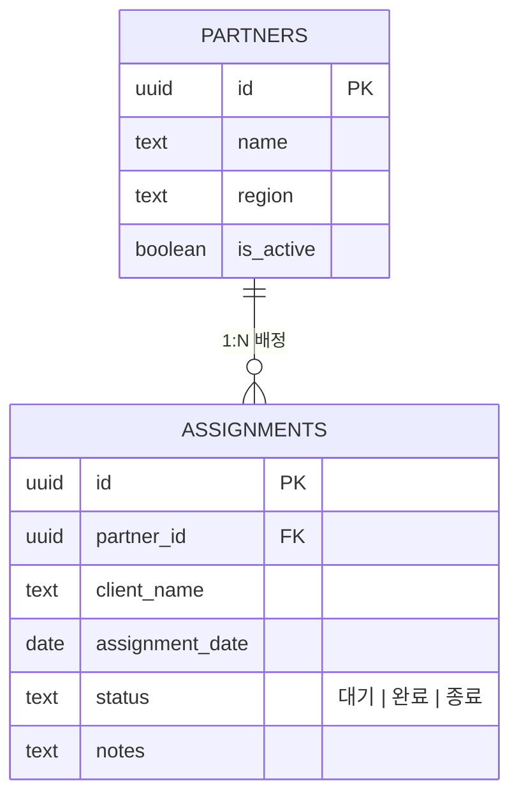
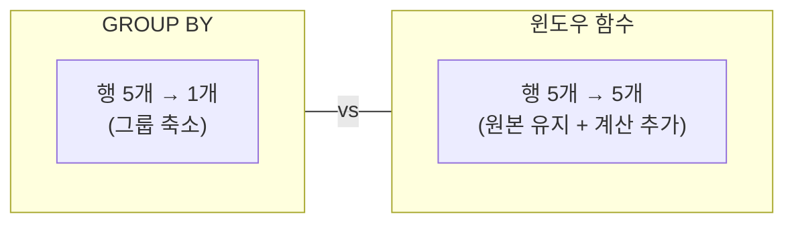
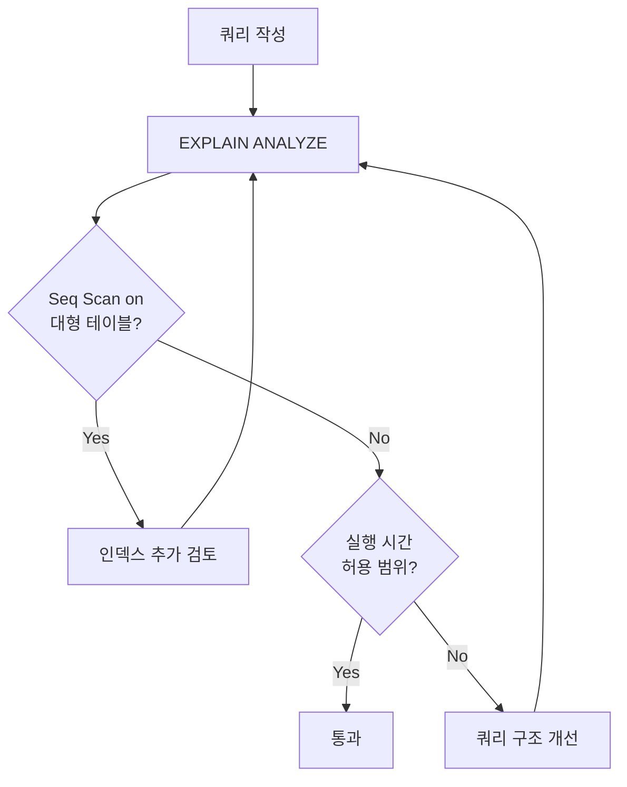
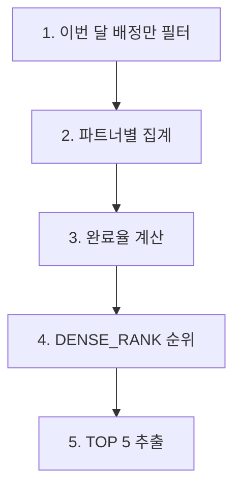
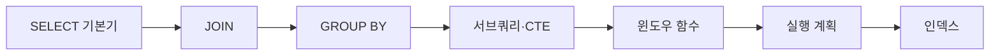

> **[NextX_Data_Solution]** · 주식회사 넥스트엑스(NEXT X) 정식 데이터 솔루션
{: .prompt-tip }

> [DB와 DBA]() 편에서 데이터베이스의 구조, ACID, 그리고 SQL 기본기를 다뤘습니다. 이 글에서는 **SELECT를 넘어**, 현업에서 매일 마주치는 JOIN·윈도우 함수·CTE·실행 계획 분석까지 한 호흡으로 정리합니다.
{: .prompt-info }

---

## 0. 예제 스키마 -- partners / assignments

이 글의 모든 예제는 [파트너스 매칭 매니저]() 프로젝트의 실제 스키마를 사용합니다.



> 파트너(partners)는 정리수납 프리랜서, 배정(assignments)은 고객 현장에 파트너를 연결한 기록입니다. status는 `'대기' → '완료' → '종료'` 흐름을 따릅니다.
{: .prompt-info }

---

## 1. SELECT 리뷰 -- 기본기 빠른 복습

심화로 넘어가기 전에 SELECT 절의 **실행 순서**를 짚고 갑니다.

```sql
SELECT   컬럼, 집계함수       -- (5) 무엇을 보여줄까
FROM     테이블               -- (1) 어디서 가져올까
WHERE    조건                 -- (2) 어떤 행을 남길까
GROUP BY 그룹 기준            -- (3) 어떻게 묶을까
HAVING   집계 조건            -- (4) 묶은 뒤 어떤 그룹을 남길까
ORDER BY 정렬 기준            -- (6) 어떤 순서로
LIMIT    행 수                -- (7) 몇 개만
```

> SQL은 **작성 순서**와 **실행 순서**가 다릅니다. WHERE가 SELECT보다 먼저 실행되기 때문에, SELECT에서 만든 별칭(alias)을 WHERE에서 쓸 수 없습니다.
{: .prompt-warning }

```sql
-- 지역별 활성 파트너 수
SELECT   region, COUNT(*) AS partner_count
FROM     partners
WHERE    is_active = true
GROUP BY region
ORDER BY partner_count DESC;
```

---

## 2. JOIN 패턴 4가지 -- 테이블 연결의 핵심

하나의 테이블만으로는 "파트너 이름 + 배정 현장 + 상태"를 한 번에 볼 수 없습니다. 정규화된 DB에서 **테이블 간 연결**은 JOIN으로 해결합니다.

### 2-1. INNER JOIN -- 양쪽 모두 있는 것만

```sql
SELECT p.name, a.client_name, a.status, a.assignment_date
FROM   partners   p
       INNER JOIN assignments a ON a.partner_id = p.id
ORDER BY a.assignment_date DESC;
```

배정이 0건인 파트너는 결과에서 빠집니다.

### 2-2. LEFT JOIN -- 왼쪽은 전부, 오른쪽은 있으면

```sql
SELECT p.name, a.client_name, a.status
FROM   partners   p
       LEFT JOIN assignments a ON a.partner_id = p.id
ORDER BY p.name;
```

배정이 없는 파트너도 포함됩니다. 오른쪽 컬럼은 NULL로 채워집니다.

### 2-3. RIGHT JOIN / FULL OUTER JOIN

RIGHT JOIN은 LEFT JOIN의 거울이며, 테이블 순서를 바꿔 LEFT JOIN으로 쓰는 것이 관례입니다. FULL OUTER JOIN은 양쪽 모두 전부 포함합니다.

### JOIN 비교 요약

| JOIN 유형 | 왼쪽 전부 | 오른쪽 전부 | 교집합만 | 실무 빈도 |
|-----------|:---------:|:-----------:|:--------:|:---------:|
| INNER JOIN | | | O | 매우 높음 |
| LEFT JOIN | O | | O | 높음 |
| RIGHT JOIN | | O | O | 낮음 |
| FULL OUTER JOIN | O | O | O | 낮음 |

### LEFT JOIN + IS NULL -- "없는 것" 찾기

현업에서 가장 자주 쓰는 패턴입니다.

```sql
-- 배정을 한 번도 받지 못한 파트너
SELECT p.name, p.region
FROM   partners   p
       LEFT JOIN assignments a ON a.partner_id = p.id
WHERE  a.id IS NULL;
```

---

## 3. GROUP BY + HAVING + 집계 함수

### 집계 함수 요약

| 함수 | 의미 | NULL 처리 |
|------|------|-----------|
| `COUNT(*)` | 전체 행 수 | NULL 포함 |
| `COUNT(col)` | NULL 제외 행 수 | NULL 제외 |
| `SUM(col)` / `AVG(col)` | 합계 / 평균 | NULL 제외 |
| `MIN(col)` / `MAX(col)` | 최솟값 / 최댓값 | NULL 제외 |

### GROUP BY + HAVING 예제

`WHERE`는 행 단위 필터, `HAVING`은 **그룹 단위** 필터입니다.

```sql
-- 배정 5건 이상인 파트너만, 상태별 집계 포함
SELECT   p.name,
         COUNT(a.id)                                  AS total,
         COUNT(*) FILTER (WHERE a.status = '완료')     AS completed,
         COUNT(*) FILTER (WHERE a.status = '대기')     AS pending,
         MIN(a.assignment_date)                        AS first_date,
         MAX(a.assignment_date)                        AS last_date
FROM     partners p
         INNER JOIN assignments a ON a.partner_id = p.id
WHERE    p.is_active = true
GROUP BY p.name
HAVING   COUNT(a.id) >= 5
ORDER BY total DESC;
```

> `FILTER (WHERE ...)` 구문은 PostgreSQL 전용입니다. MySQL에서는 `SUM(CASE WHEN status = '완료' THEN 1 ELSE 0 END)`로 대체합니다.
{: .prompt-warning }

---

## 4. 서브쿼리 -- 쿼리 안의 쿼리

서브쿼리는 SQL 문 안에 중첩된 또 다른 SELECT입니다. 위치에 따라 역할이 달라집니다.

### WHERE 절 -- 필터로 쓰기

```sql
-- "완료" 배정이 가장 많은 파트너
SELECT name FROM partners
WHERE  id = (
    SELECT   partner_id FROM assignments
    WHERE    status = '완료'
    GROUP BY partner_id
    ORDER BY COUNT(*) DESC LIMIT 1
);
```

### FROM 절 -- 인라인 뷰로 쓰기

```sql
-- 파트너별 완료율 → 50% 이상만
SELECT sub.name, sub.total, sub.completed,
       ROUND(sub.completed * 100.0 / NULLIF(sub.total, 0), 1) AS rate
FROM (
    SELECT p.name, COUNT(a.id) AS total,
           COUNT(*) FILTER (WHERE a.status = '완료') AS completed
    FROM   partners p LEFT JOIN assignments a ON a.partner_id = p.id
    GROUP BY p.name
) sub
WHERE sub.total > 0 AND (sub.completed * 100.0 / sub.total) >= 50;
```

서브쿼리가 3단 이상 중첩되면 **가독성이 급격히 떨어집니다.** 이 문제를 해결하는 것이 CTE입니다.

---

## 5. CTE(Common Table Expression) -- 서브쿼리의 진화

`WITH` 절로 **임시 결과 집합에 이름을 붙여** 위에서 아래로 읽히는 쿼리를 만듭니다.

### 서브쿼리 vs CTE

```sql
-- 서브쿼리: 안에서 밖으로 읽어야 함
SELECT * FROM (
    SELECT partner_id, COUNT(*) AS cnt
    FROM assignments WHERE status = '완료' GROUP BY partner_id
) sub WHERE sub.cnt >= 3;

-- CTE: 위에서 아래로 자연스럽게 읽힘
WITH completed_counts AS (
    SELECT partner_id, COUNT(*) AS cnt
    FROM assignments WHERE status = '완료' GROUP BY partner_id
)
SELECT * FROM completed_counts WHERE cnt >= 3;
```

### CTE 체이닝 -- 여러 단계 연결

CTE의 진정한 힘은 **파이프라인처럼 연결**할 수 있다는 점입니다. 아래 예제는 섹션 9 종합 예제에서 더 자세히 다룹니다.

```sql
WITH
partner_stats AS (
    SELECT p.name, COUNT(a.id) AS total,
           COUNT(*) FILTER (WHERE a.status = '완료') AS completed
    FROM   partners p LEFT JOIN assignments a ON a.partner_id = p.id
    WHERE  p.is_active = true
    GROUP BY p.name
),
with_rate AS (
    SELECT *, ROUND(completed * 100.0 / NULLIF(total, 0), 1) AS rate
    FROM partner_stats WHERE total > 0
)
SELECT name, total, completed, rate
FROM   with_rate WHERE rate >= 70 ORDER BY rate DESC;
```

### CTE vs 서브쿼리 비교

| 항목 | 서브쿼리 | CTE |
|------|----------|-----|
| 가독성 | 안에서 밖으로 | 위에서 아래로 |
| 재사용 | 같은 서브쿼리를 복사 | 이름으로 여러 번 참조 |
| 재귀 | 불가 | `WITH RECURSIVE` 가능 |
| 디버깅 | 단계별 확인 어려움 | CTE 하나씩 실행 가능 |

> CTE는 "읽는 사람을 배려하는 SQL"입니다. 다른 팀원이 내 쿼리를 유지보수할 수 있으려면 서브쿼리보다 CTE를 우선 사용하세요.
{: .prompt-tip }

---

## 6. 윈도우 함수 -- 행 간 계산의 끝판왕

`GROUP BY`가 여러 행을 **하나로 합치는** 반면, 윈도우 함수는 **행을 유지하면서** 그룹 단위 계산을 추가합니다.



### 기본 구문

```sql
함수() OVER (
    PARTITION BY 그룹_기준    -- 어떤 단위로 나눌까
    ORDER BY     정렬_기준    -- 그 안에서 어떤 순서로
)
```

### 6-1. ROW_NUMBER, RANK, DENSE_RANK

```sql
SELECT p.name,
       COUNT(a.id) AS total,
       ROW_NUMBER() OVER (ORDER BY COUNT(a.id) DESC) AS rn,
       RANK()       OVER (ORDER BY COUNT(a.id) DESC) AS rnk,
       DENSE_RANK() OVER (ORDER BY COUNT(a.id) DESC) AS dense_rnk
FROM   partners p
       INNER JOIN assignments a ON a.partner_id = p.id
GROUP BY p.name;
```

| name | total | ROW_NUMBER | RANK | DENSE_RANK |
|------|------:|-----------:|-----:|-----------:|
| 김정리 | 12 | 1 | 1 | 1 |
| 이수납 | 10 | 2 | 2 | 2 |
| 박깨끗 | 10 | 3 | 2 | 2 |
| 최청소 | 7 | 4 | 4 | 3 |

- **ROW_NUMBER**: 동점이어도 순번이 다름 (유일한 번호)
- **RANK**: 동점이면 같은 순위, 다음을 건너뜀 (2, 2, 4)
- **DENSE_RANK**: 동점이면 같은 순위, 건너뛰지 않음 (2, 2, 3)

### 6-2. LAG / LEAD -- 이전-다음 행 참조

```sql
-- 파트너별 배정 간격(일) 계산
SELECT p.name, a.assignment_date,
       LAG(a.assignment_date) OVER (PARTITION BY p.id ORDER BY a.assignment_date) AS prev_date,
       a.assignment_date - LAG(a.assignment_date)
           OVER (PARTITION BY p.id ORDER BY a.assignment_date) AS days_gap
FROM   partners p INNER JOIN assignments a ON a.partner_id = p.id
ORDER BY p.name, a.assignment_date;
```

### 6-3. SUM OVER -- 누적 합계

```sql
SELECT a.assignment_date, COUNT(*) AS daily_count,
       SUM(COUNT(*)) OVER (ORDER BY a.assignment_date) AS running_total
FROM   assignments a
GROUP BY a.assignment_date ORDER BY a.assignment_date;
```

### 윈도우 함수 정리표

| 함수 | 용도 | 활용 예 |
|------|------|---------|
| `ROW_NUMBER()` | 유일한 순번 | 페이징, 중복 제거 |
| `RANK()` / `DENSE_RANK()` | 순위 | 랭킹 보드, 등급 산정 |
| `LAG(col, n)` / `LEAD(col, n)` | 이전/이후 행 | 전월 대비 변화량 |
| `SUM() OVER` / `AVG() OVER` | 누적/이동 집계 | 러닝 토탈, 이동 평균 |
| `NTILE(n)` | n등분 | 상위 25% 파트너 구분 |

---

## 7. 실행 계획 -- 느린 쿼리 진단

### EXPLAIN ANALYZE

쿼리를 **실제로 실행**하면서 각 단계별 소요 시간과 처리 행 수를 보여줍니다.

```sql
EXPLAIN ANALYZE
SELECT p.name, COUNT(a.id) AS total
FROM   partners p LEFT JOIN assignments a ON a.partner_id = p.id
GROUP BY p.name ORDER BY total DESC;

-- 결과 예시 (축약)
-- Hash Left Join  (actual time=0.045..0.310 rows=800)
--   -> Seq Scan on assignments a  (rows=800)
--   -> Seq Scan on partners p     (rows=10)
-- Execution Time: 0.573 ms
```

### 핵심 키워드 해석

| 키워드 | 의미 | 주의 시점 |
|--------|------|-----------|
| **Seq Scan** | 테이블 전체 스캔 | 대형 테이블에서 비용 높을 때 |
| **Index Scan** | 인덱스 활용 스캔 | 정상적이고 효율적 |
| **Hash Join** | 해시 테이블로 JOIN | 대체로 효율적 |
| **Nested Loop** | 중첩 반복 JOIN | 양쪽 다 클 때 느림 |
| **Sort** | 정렬 | 메모리 초과 시 디스크 사용 |



> `EXPLAIN ANALYZE`는 **실제로 쿼리를 실행합니다.** UPDATE/DELETE에 사용할 때는 트랜잭션으로 감싸세요: `BEGIN; EXPLAIN ANALYZE UPDATE ...; ROLLBACK;`
{: .prompt-warning }

---

## 8. 인덱스 전략 기초

인덱스는 책의 **색인**과 같습니다. 전체를 넘기지 않고 원하는 페이지로 바로 갈 수 있게 해줍니다.

### 언제 만들까?

| 만들어야 할 때 | 만들지 않아도 될 때 |
|----------------|---------------------|
| WHERE에 자주 쓰는 컬럼 | 행 수백 건 이하의 작은 테이블 |
| JOIN ON의 FK 컬럼 | 거의 모든 행이 같은 값인 컬럼 |
| ORDER BY에 자주 쓰는 컬럼 | INSERT가 매우 빈번한 테이블 |

### 파트너스 프로젝트 적용

```sql
-- FK로 JOIN할 때마다 사용
CREATE INDEX idx_assignments_partner_id ON assignments (partner_id);

-- status 필터링 빈번
CREATE INDEX idx_assignments_status ON assignments (status);

-- 날짜 범위 + status 복합 인덱스 (왼쪽부터 사용됨!)
CREATE INDEX idx_assignments_date_status ON assignments (assignment_date, status);
```

> 복합 인덱스는 **선두 컬럼**부터 사용됩니다. `(assignment_date, status)` 인덱스에서 `WHERE status = '완료'`만 쓰면 인덱스를 타지 못할 수 있습니다. 컬럼 순서를 쿼리 패턴에 맞추세요.
{: .prompt-warning }

> 인덱스는 "읽기 성능 vs 쓰기 비용"의 트레이드오프입니다. EXPLAIN ANALYZE로 확인한 뒤 **필요한 곳에만** 추가하세요.
{: .prompt-tip }

---

## 9. 실전 종합 예제 -- 이번 달 배정 완료율 TOP 5 파트너

지금까지 배운 기법을 하나의 쿼리에 녹여봅니다.

**요구사항:** 2026년 7월 기준, 활성 파트너 중 배정 1건 이상인 파트너의 **완료율 상위 5명**. 동점이면 총 배정이 많은 파트너 우선.

### 설계 흐름



### 최종 쿼리

```sql
WITH
-- 1단계: 이번 달 배정만
monthly_assignments AS (
    SELECT partner_id, status
    FROM   assignments
    WHERE  assignment_date >= DATE_TRUNC('month', CURRENT_DATE)
      AND  assignment_date <  DATE_TRUNC('month', CURRENT_DATE) + INTERVAL '1 month'
),
-- 2단계: 파트너별 통계
partner_stats AS (
    SELECT p.id, p.name, p.region,
           COUNT(ma.partner_id)                        AS total,
           COUNT(*) FILTER (WHERE ma.status = '완료')   AS completed
    FROM   partners p
           INNER JOIN monthly_assignments ma ON ma.partner_id = p.id
    WHERE  p.is_active = true
    GROUP BY p.id, p.name, p.region
    HAVING COUNT(ma.partner_id) >= 1
),
-- 3단계: 완료율 + 순위
ranked AS (
    SELECT name, region, total, completed,
           ROUND(completed * 100.0 / total, 1) AS completion_rate,
           DENSE_RANK() OVER (
               ORDER BY ROUND(completed * 100.0 / total, 1) DESC, total DESC
           ) AS rank
    FROM   partner_stats
)
-- 4단계: TOP 5
SELECT rank, name, region, total, completed,
       completion_rate || '%' AS completion_rate
FROM   ranked
WHERE  rank <= 5
ORDER BY rank;
```

### 예상 결과

| rank | name | region | total | completed | completion_rate |
|-----:|------|--------|------:|----------:|:---------------:|
| 1 | 김정리 | 서울 강서 | 12 | 11 | 91.7% |
| 2 | 이수납 | 서울 마포 | 10 | 8 | 80.0% |
| 3 | 최청소 | 경기 성남 | 8 | 6 | 75.0% |
| 4 | 박깨끗 | 서울 송파 | 6 | 4 | 66.7% |
| 5 | 한빛남 | 인천 남동 | 5 | 3 | 60.0% |

### 쿼리 포인트 해설

| 기법 | 역할 |
|------|------|
| CTE 체이닝 | 4단계로 쪼개 가독성 확보 |
| `DATE_TRUNC` | 이번 달 시작일을 동적 계산 |
| `FILTER (WHERE)` | 완료 건만 별도 집계 |
| `HAVING` | 배정 1건 이상만 남김 |
| `DENSE_RANK()` | 동점 처리 + 연속 순위 |

> [데이터 클렌징]() 편에서 강조했듯, 분석 쿼리의 정확도는 **원본 데이터 품질**에 직결됩니다. status 값이 오염되어 있으면 완료율 자체를 신뢰할 수 없습니다.
{: .prompt-info }

---

## 현업 SQL 팁 모음

```sql
-- 1. 별칭은 의미 있게 (a, b 대신 p, a)
SELECT p.name, a.status FROM partners p JOIN assignments a ...

-- 2. NULL 비교는 반드시 IS NULL
WHERE notes IS NULL          -- O
WHERE notes = NULL           -- X (항상 FALSE)

-- 3. COALESCE로 NULL 기본값
SELECT COALESCE(a.notes, '(메모 없음)') AS notes ...

-- 4. 날짜 연산은 함수로
WHERE assignment_date >= CURRENT_DATE - INTERVAL '7 days'
WHERE assignment_date >= DATE_TRUNC('quarter', CURRENT_DATE)

-- 5. 대량 데이터에서 EXISTS > IN
SELECT * FROM partners p
WHERE EXISTS (
    SELECT 1 FROM assignments a
    WHERE a.partner_id = p.id AND a.status = '완료'
);
```

---

## 마무리 -- SQL 심화 로드맵



| 섹션 | 핵심 | 한 줄 요약 |
|------|------|-----------|
| SELECT 리뷰 | 실행 순서 | 작성 순서와 실행 순서는 다르다 |
| JOIN | INNER, LEFT, FULL | 테이블을 연결하는 4가지 방법 |
| GROUP BY / HAVING | 집계 + 그룹 필터 | 행 필터 vs 그룹 필터를 구분하라 |
| 서브쿼리 / CTE | WITH, 체이닝 | 이름을 붙여 읽기 쉬운 쿼리를 만든다 |
| 윈도우 함수 | RANK, LAG, SUM OVER | 행을 유지하며 그룹 계산을 추가한다 |
| 실행 계획 | EXPLAIN ANALYZE | 느린 쿼리의 병목을 찾는다 |
| 인덱스 | 복합 인덱스, 선두 컬럼 | 읽기 성능과 쓰기 비용의 트레이드오프 |

다음 글 [데이터 거버넌스]()에서는 이렇게 쌓인 데이터를 조직 차원에서 **관리하고 보호하는 체계**를 다룹니다.

---

*NEXT X R&D · Data Engineering*
