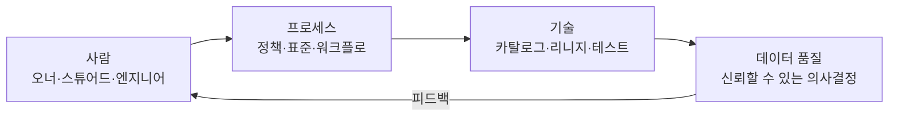
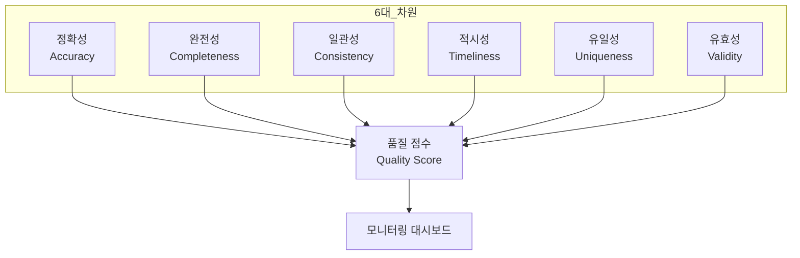
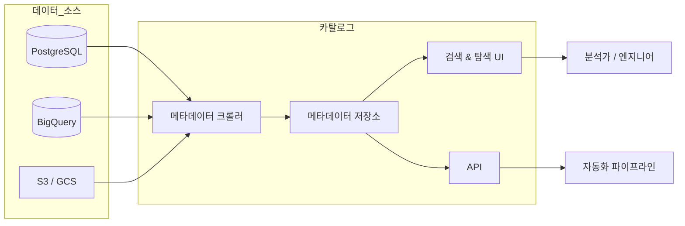
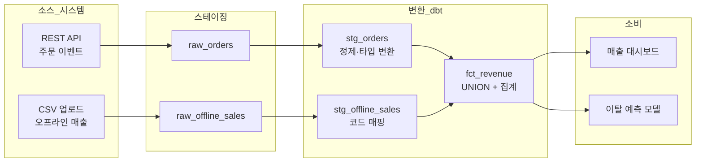
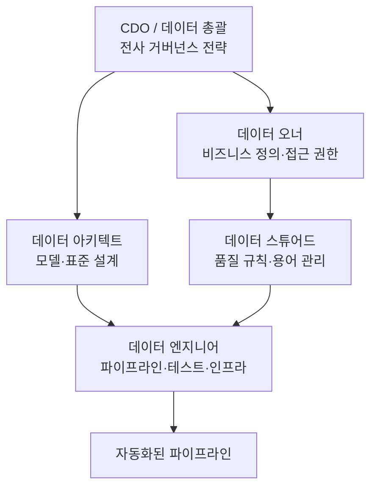
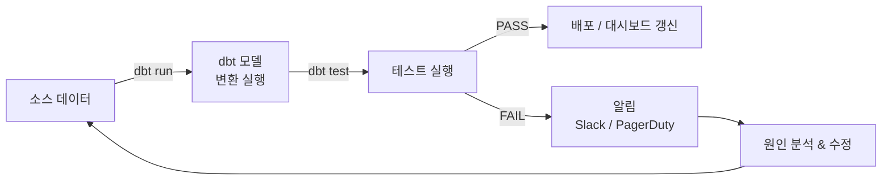
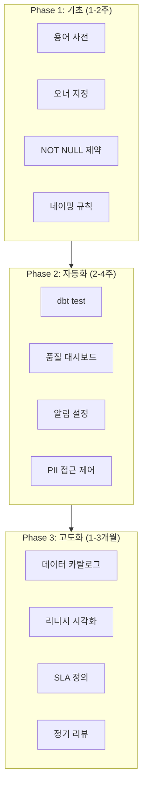
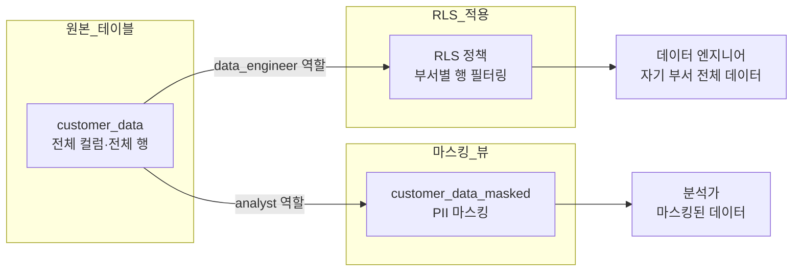
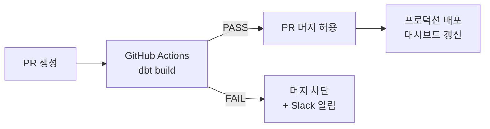
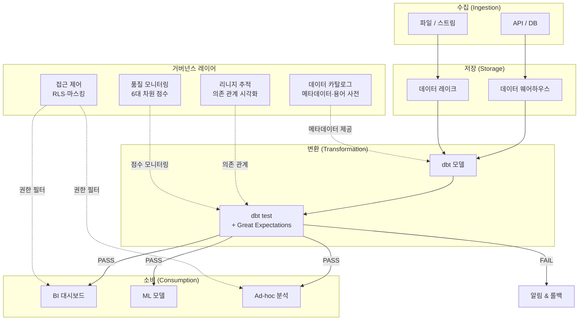

> **[NextX_Data_Solution]** · 주식회사 넥스트엑스(NEXT X) 정식 데이터 솔루션
{: .prompt-tip }

> [데이터 클렌징]()에서 "더러운 데이터를 정제하는 법"을 다뤘고, [데이터 해석의 함정]()에서 "깨끗해 보여도 잘못 읽을 수 있다"는 위험을 살펴봤습니다. 이번 글에서는 **한 발 더 올라가서**, 데이터가 태어나는 순간부터 사라지는 순간까지 **조직 차원에서 품질을 보장하는 체계** — 데이터 거버넌스를 다룹니다.
{: .prompt-info }

---

## 1. 쓰레기가 들어가면 쓰레기가 나온다 — GIGO

**Garbage In, Garbage Out(GIGO)** 는 컴퓨터 과학에서 가장 오래된 경구 중 하나입니다.

| 상황 | 원인 | 결과 |
|------|------|------|
| 매출 리포트가 매번 다르게 나온다 | 동일 지표를 팀마다 다른 SQL로 계산 | 경영진이 데이터를 **불신** |
| 마케팅 CAC가 음수로 찍힌다 | 광고비 필드에 NULL이 섞여 있음 | 잘못된 예산 의사결정 |
| 고객 이탈 예측 모델 정확도가 50 % | 학습 데이터에 중복 레코드 40 % | 모델이 사실상 **동전 던지기** |

> "우리 회사는 데이터가 많아요"라는 말은 자랑이 아닙니다. **믿을 수 있는 데이터가 얼마나 있느냐**가 진짜 경쟁력입니다.
{: .prompt-warning }

데이터 거버넌스는 이 문제에 대한 **조직적 해법**입니다. 단순히 도구를 도입하는 것이 아니라, **사람 - 프로세스 - 기술** 세 축을 정렬하는 것입니다.



거버넌스가 없으면 **클렌징은 소방수 역할**에 그칩니다. 불이 날 때마다 끄지만, 근본 원인은 해결되지 않죠. 거버넌스는 **방화 시스템**입니다 — 애초에 불이 나지 않도록 설계합니다.

> 관련 읽기 → [데이터 클렌징 — 더러운 데이터를 정제하는 기술]()
{: .prompt-info }

---

## 2. 데이터 품질의 6대 차원

데이터 품질을 정의하지 않으면 "좋은 데이터"는 그저 **감**에 의존하게 됩니다. 국제 표준(ISO 8000, DAMA DMBOK)에서 공통적으로 언급하는 6대 차원을 살펴봅시다.

| 차원 | 영문 | 한 줄 정의 | 위반 예시 |
|------|------|-----------|----------|
| **정확성** | Accuracy | 현실 세계의 실제 값과 일치하는가? | 서울 본사 주소가 "부산"으로 입력됨 |
| **완전성** | Completeness | 필수 필드가 빠짐없이 채워져 있는가? | 고객 테이블의 `email` 컬럼 NULL 비율 35 % |
| **일관성** | Consistency | 서로 다른 시스템에서 같은 값을 나타내는가? | CRM에서는 "삼성전자", ERP에서는 "Samsung Electronics" |
| **적시성** | Timeliness | 필요한 시점에 데이터가 준비되어 있는가? | 일간 매출 리포트가 D+3에야 갱신 |
| **유일성** | Uniqueness | 동일 엔티티가 중복 없이 1건만 존재하는가? | 같은 고객이 3개 레코드로 존재 |
| **유효성** | Validity | 정의된 포맷·규칙·범위를 만족하는가? | 전화번호 필드에 알파벳 문자 포함 |

### 차원별 측정 공식

```
정확성 = 정확한 레코드 수 / 전체 레코드 수 × 100
완전성 = (1 - NULL 비율) × 100
유일성 = (전체 건수 - 중복 건수) / 전체 건수 × 100
```

> 품질 점수를 **수치로 관리**해야 개선 여부를 추적할 수 있습니다. "체감상 좋아졌다"는 근거가 아닙니다.
{: .prompt-tip }



> 관련 읽기 → [데이터 해석의 함정 — 생존자 편향부터 심슨의 역설까지]()
{: .prompt-info }

---

## 3. 데이터 카탈로그 — "이 테이블이 뭔지 아는 사람?" 문제 해결

### 왜 카탈로그가 필요한가

현실에서 흔히 발생하는 장면:

1. 신규 입사자가 "`stg_orders_v2_final` 테이블이 뭔가요?" 라고 슬랙에 질문
2. 팀원 A: "그건 안 쓰는 테이블이에요"
3. 팀원 B: "아닌데요, 매출 리포트 소스인데요"
4. 결국 만든 사람(퇴사)만 알고 있었음

**데이터 카탈로그**는 조직의 모든 데이터 자산에 대한 **메타데이터 저장소**입니다. 도서관의 카드 목록처럼, 어떤 데이터가 어디에 있고, 무엇을 의미하며, 누가 관리하는지 한눈에 파악할 수 있게 해줍니다.

### 카탈로그에 담기는 정보

| 메타데이터 유형 | 설명 | 예시 |
|----------------|------|------|
| **기술 메타데이터** | 스키마, 데이터 타입, 파티션 정보 | `orders.created_at` — `TIMESTAMP`, 일별 파티션 |
| **비즈니스 메타데이터** | 업무 정의, 계산 로직, 용어 사전 | "MAU = 월간 1회 이상 로그인한 고유 사용자 수" |
| **운영 메타데이터** | 최종 갱신 시각, 소유자, SLA | 매일 06:00 KST 갱신, 오너: 데이터팀 |
| **소셜 메타데이터** | 인기도, 질문/답변, 평점 | "이 테이블은 주 120회 쿼리됨" |

### 주요 카탈로그 도구 비교

| 도구 | 유형 | 핵심 특징 | 적합 조직 |
|------|------|----------|----------|
| **DataHub** (LinkedIn) | 오픈소스 | GraphQL API, 풍부한 통합 | 엔지니어 중심 조직 |
| **Atlan** | SaaS | 비즈니스 친화적 UI, Slack 통합 | 비즈니스+엔지니어 혼합 |
| **OpenMetadata** | 오픈소스 | dbt 네이티브 통합 | dbt 사용 조직 |
| **Google Data Catalog** | GCP 네이티브 | BigQuery 자동 연동 | GCP 기반 조직 |
| **AWS Glue Data Catalog** | AWS 네이티브 | Athena·Redshift 연동 | AWS 기반 조직 |



> 카탈로그 도입의 첫 번째 단계는 **도구 선택이 아니라 용어 사전(Glossary) 작성**입니다. 용어 정의 없이 카탈로그를 채우면 메타데이터 자체가 혼란을 키웁니다.
{: .prompt-warning }

---

## 4. 데이터 리니지 — 데이터의 족보 추적

### 리니지란?

**데이터 리니지(Data Lineage)** 는 데이터가 **어디서 생성되어, 어떤 변환을 거쳐, 최종적으로 어디에서 소비되는지** 추적하는 것입니다. 족보(가계도)라고 생각하면 됩니다.

리니지가 없으면 이런 질문에 답할 수 없습니다:

- "매출 대시보드의 숫자가 이상한데, **원본 데이터는 어디서 온 거지?**"
- "이 컬럼을 삭제해도 되나? **어디서 참조하고 있지?**"
- "`raw_events` 테이블 스키마가 바뀌면 **어떤 다운스트림이 깨지지?**"

### 리니지의 종류

| 종류 | 추적 범위 | 예시 |
|------|----------|------|
| **테이블 리니지** | 테이블 간 의존 관계 | `raw_orders` → `stg_orders` → `fct_orders` |
| **컬럼 리니지** | 컬럼 단위 변환 추적 | `raw.price * raw.qty` → `stg.revenue` |
| **파이프라인 리니지** | ETL/ELT 작업 단위 추적 | Airflow DAG `daily_etl` → dbt model → Looker 대시보드 |



### 리니지 도구

| 도구 | 방식 | 특징 |
|------|------|------|
| **dbt** | SQL 파싱 기반 | `ref()` 함수로 자동 리니지 생성, `dbt docs generate` |
| **OpenLineage** | 이벤트 기반 (오픈소스) | Airflow·Spark 등 다양한 런타임 지원 |
| **Monte Carlo** | 자동 탐지 | ML 기반 이상 탐지 + 리니지 결합 |
| **Atlan** | 크롤링 + 수동 보강 | 비즈니스 컨텍스트까지 연결 |

> 리니지는 **장애 대응 시간(MTTR)을 극적으로 줄입니다**. "어디가 깨졌지?"를 5분 안에 파악할 수 있느냐 없느냐의 차이입니다.
{: .prompt-tip }

> 관련 읽기 → [데이터 파이프라인이란?]() — 리니지는 파이프라인의 "지도"에 해당합니다.
{: .prompt-info }

---

## 5. 조직 역할 — 데이터 오너, 스튜어드, 엔지니어

거버넌스는 도구만으로 작동하지 않습니다. **누가 무엇을 책임지는가**가 명확해야 합니다.

### 역할 정의

| 역할 | 누구? | 핵심 책임 | 비유 |
|------|------|----------|------|
| **데이터 오너** | 비즈니스 부서장 | 데이터의 비즈니스 정의 승인, 접근 권한 결정 | 건물 **소유주** |
| **데이터 스튜어드** | 도메인 전문가 (실무자) | 품질 규칙 정의, 이슈 분류, 용어 사전 관리 | 건물 **관리인** |
| **데이터 엔지니어** | 엔지니어링 팀 | 파이프라인 구축, 테스트 자동화, 인프라 운영 | 건물 **시공사** |
| **데이터 아키텍트** | 기술 리더 | 전사 데이터 모델 설계, 표준 수립 | 건물 **설계사** |



### 흔한 실수

> "데이터팀이 데이터 품질을 책임져야 한다" — 이것은 **가장 흔한 오해**입니다. 데이터의 **비즈니스 정의와 정확성**은 해당 데이터를 생성하는 **비즈니스 부서(오너)**가 책임져야 합니다. 데이터팀은 **기술적 품질(파이프라인 안정성, 테스트 자동화)**을 책임집니다.
{: .prompt-warning }

| 안티 패턴 | 문제 | 해결 |
|----------|------|------|
| 오너 없는 테이블 | 스키마 변경 시 누구에게 물어야 할지 모름 | 모든 테이블에 오너 태그 필수 |
| 스튜어드 = 엔지니어 | 비즈니스 맥락 누락, 기술 부채만 관리 | 도메인 실무자를 스튜어드로 지정 |
| 거버넌스 위원회만 있고 실행 없음 | 분기 1회 회의만 하고 변하는 게 없음 | 주간 품질 리뷰 + 자동화 연동 |

> 관련 읽기 → [DB와 DBA]() — DBA 역할과 데이터 스튜어드의 관계를 이해하는 데 도움이 됩니다.
{: .prompt-info }

---

## 6. 실전 도구 — dbt tests, Great Expectations, Monte Carlo

### 6-1. dbt tests — SQL 파이프라인의 품질 관문

[dbt(Data Build Tool)](https://www.getdbt.com/)는 ELT 파이프라인에서 **변환(T)** 을 담당하는 도구입니다. dbt의 **테스트 기능**은 거버넌스의 핵심 실행 수단입니다.

#### 기본 제공 테스트 (Generic Tests)

```yaml
# models/schema.yml
version: 2

models:
  - name: fct_orders
    description: "주문 팩트 테이블 — 건별 매출 정보"
    columns:
      - name: order_id
        description: "주문 고유 식별자"
        tests:
          - unique          # 유일성 검증
          - not_null        # 완전성 검증
      - name: order_amount
        description: "주문 금액 (KRW)"
        tests:
          - not_null
          - dbt_utils.accepted_range:
              min_value: 0
              max_value: 100000000  # 1억 이상이면 이상치
      - name: status
        description: "주문 상태"
        tests:
          - accepted_values:
              values: ['pending', 'confirmed', 'shipped', 'delivered', 'cancelled']
      - name: customer_id
        description: "고객 FK"
        tests:
          - not_null
          - relationships:
              to: ref('dim_customers')
              field: customer_id  # 참조 무결성 검증
```

#### 커스텀 테스트 (Singular Test)

```sql
-- tests/assert_no_future_orders.sql
-- 미래 날짜 주문이 없어야 함
SELECT
    order_id,
    created_at
FROM {{ ref('fct_orders') }}
WHERE created_at > CURRENT_TIMESTAMP
```

#### dbt test 실행 흐름



### 6-2. Great Expectations — 언어 중립 데이터 검증

[Great Expectations](https://greatexpectations.io/)는 Python 기반의 데이터 검증 프레임워크입니다. dbt가 SQL 파이프라인에 특화되어 있다면, GE는 **CSV, Pandas DataFrame, Spark** 등 다양한 소스를 지원합니다.

```python
import great_expectations as gx

# 데이터 소스 연결
context = gx.get_context()

# Expectation Suite 정의
suite = context.add_expectation_suite("orders_quality_suite")

# 기대 조건 추가
validator = context.get_validator(
    batch_request=batch_request,
    expectation_suite_name="orders_quality_suite"
)

# 완전성: NULL 불허
validator.expect_column_values_to_not_be_null("order_id")

# 유효성: 값 범위
validator.expect_column_values_to_be_between(
    "order_amount", min_value=0, max_value=100_000_000
)

# 유일성: 중복 불허
validator.expect_column_values_to_be_unique("order_id")

# 일관성: 허용 값 목록
validator.expect_column_values_to_be_in_set(
    "status",
    ["pending", "confirmed", "shipped", "delivered", "cancelled"]
)

# 검증 실행
results = validator.validate()
print(f"성공: {results.success}")
```

### 6-3. 도구 비교 요약

| 기준 | **dbt tests** | **Great Expectations** | **Monte Carlo** | **Atlan** |
|------|--------------|----------------------|----------------|----------|
| **유형** | 오픈소스 (Core) / SaaS (Cloud) | 오픈소스 (OSS) / SaaS (Cloud) | SaaS | SaaS |
| **검증 대상** | SQL 모델 | 모든 데이터 소스 | 모든 데이터 소스 | 메타데이터 + 품질 |
| **리니지** | ref() 기반 자동 | 없음 (별도 도구) | ML 기반 자동 탐지 | 크롤링 기반 |
| **이상 탐지** | 규칙 기반 | 규칙 기반 | **ML 기반 자동** | 규칙 기반 |
| **알림** | Slack, Email (Cloud) | Slack, Email | Slack, PagerDuty, Opsgenie | Slack, Jira |
| **러닝 커브** | 낮음 (SQL 아는 팀) | 중간 (Python 필요) | 낮음 (자동 설정) | 낮음 |
| **비용** | Core 무료 | OSS 무료 | 고가 (엔터프라이즈) | 중~고가 |
| **추천** | dbt 사용 조직 필수 | Python 파이프라인 | 규모 있는 조직 | 카탈로그+품질 통합 |

> dbt를 이미 사용 중이라면 **dbt tests부터 시작**하세요. 추가 인프라 없이 기존 파이프라인에 품질 관문을 바로 추가할 수 있습니다.
{: .prompt-tip }

> 관련 읽기 → [SQL 실전 심화]() — dbt 모델의 기반이 되는 SQL 고급 패턴을 다룹니다.
{: .prompt-info }

---

## 7. 소규모 조직에서 시작하는 거버넌스 체크리스트

"거버넌스는 대기업 얘기 아닌가요?" — **아닙니다.** 데이터를 쓰는 순간 거버넌스는 필요합니다. 규모에 맞춰 시작하면 됩니다.

### Phase 1 — 기초 다지기 (1-2주)

| 항목 | 구체적 행동 | 완료 기준 |
|------|-----------|----------|
| 용어 사전 만들기 | 핵심 비즈니스 지표 10개 정의 (MAU, ARR, Churn Rate 등) | 스프레드시트 또는 Notion에 문서화 |
| 테이블 오너 지정 | 주요 테이블 20개에 오너 태그 부여 | 카탈로그 또는 `schema.yml`에 기록 |
| NOT NULL 제약 추가 | 필수 컬럼에 DB 레벨 제약 조건 | `ALTER TABLE` 실행 완료 |
| 네이밍 규칙 수립 | `raw_`, `stg_`, `dim_`, `fct_` 접두사 표준 | 문서화 + 팀 공유 |

### Phase 2 — 자동화 (2-4주)

| 항목 | 구체적 행동 | 완료 기준 |
|------|-----------|----------|
| dbt test 도입 | 핵심 모델에 `unique`, `not_null`, `relationships` 테스트 추가 | CI에서 `dbt test` 통과 필수 |
| 품질 대시보드 | NULL 비율, 중복률, 갱신 지연 시각화 | Grafana / Looker 대시보드 1개 |
| 알림 설정 | 테스트 실패 시 Slack 채널 알림 | `#data-alerts` 채널 운영 |
| PII 접근 제어 | 민감 컬럼 식별 + 접근 권한 정리 | RLS 또는 뷰 기반 마스킹 |

### Phase 3 — 고도화 (1-3개월)

| 항목 | 구체적 행동 | 완료 기준 |
|------|-----------|----------|
| 데이터 카탈로그 | DataHub 또는 OpenMetadata 도입 | 팀원이 셀프 서비스로 테이블 검색 가능 |
| 리니지 시각화 | dbt docs 또는 별도 리니지 도구 | 주요 파이프라인 end-to-end 리니지 확인 가능 |
| SLA 정의 | 핵심 테이블별 갱신 주기 약속 | 위반 시 자동 알림 |
| 정기 리뷰 | 월간 품질 리뷰 미팅 | 점수 추이 리포트 발행 |



> 완벽한 거버넌스를 한 번에 만들려고 하지 마세요. **Phase 1만으로도 데이터 신뢰도가 크게 올라갑니다.**
{: .prompt-tip }

---

## 8. 넥스트엑스 사례 — PII 보호, RLS 정책, NOT NULL 제약

### 8-1. PII 보호 — `.gitignore`와 환경 변수

넥스트엑스에서는 **개인 식별 정보(PII)**가 코드 저장소에 유출되지 않도록 다중 방어선을 운영합니다.

```gitignore
# .gitignore — PII·시크릿 방어
*.csv
*.xlsx
*.json
!package.json
!tsconfig.json
.env
.env.*
credentials/
secrets/
data/raw/
```

| 방어선 | 방법 | 목적 |
|--------|------|------|
| **1차: .gitignore** | 데이터 파일·환경 변수 파일 제외 | 실수로 커밋 방지 |
| **2차: pre-commit hook** | `detect-secrets` 훅으로 비밀 키 탐지 | 커밋 시점 차단 |
| **3차: CI 스캔** | GitHub Secret Scanning 활성화 | 푸시 시점 차단 |
| **4차: 접근 제어** | DB 레벨 RLS + 뷰 마스킹 | 쿼리 시점 보호 |

### 8-2. RLS(Row-Level Security) 정책

**RLS**는 같은 테이블이라도 **사용자 역할에 따라 볼 수 있는 행을 제한**하는 기능입니다.

```sql
-- PostgreSQL RLS 정책 예시
-- 1) RLS 활성화
ALTER TABLE customer_data ENABLE ROW LEVEL SECURITY;

-- 2) 정책 생성: 각 부서는 자기 부서 데이터만 조회 가능
CREATE POLICY department_isolation ON customer_data
    FOR SELECT
    USING (department_id = current_setting('app.current_department')::INT);

-- 3) 분석가 역할: PII 컬럼 마스킹 뷰
CREATE VIEW customer_data_masked AS
SELECT
    customer_id,
    -- 이름: 첫 글자만 노출
    LEFT(name, 1) || '***' AS name,
    -- 이메일: 도메인만 노출
    '***@' || SPLIT_PART(email, '@', 2) AS email,
    -- 전화번호: 뒷 4자리만 노출
    '***-****-' || RIGHT(phone, 4) AS phone,
    department_id,
    created_at
FROM customer_data;

-- 4) 역할별 권한 부여
GRANT SELECT ON customer_data TO data_engineer;     -- 전체 접근
GRANT SELECT ON customer_data_masked TO analyst;     -- 마스킹된 뷰만
```



### 8-3. NOT NULL 제약 — 완전성의 첫 번째 방어선

가장 단순하지만 가장 효과적인 품질 관문입니다.

```sql
-- 테이블 생성 시 NOT NULL 명시
CREATE TABLE orders (
    order_id    BIGINT       NOT NULL PRIMARY KEY,
    customer_id BIGINT       NOT NULL REFERENCES customers(customer_id),
    order_date  DATE         NOT NULL DEFAULT CURRENT_DATE,
    status      VARCHAR(20)  NOT NULL DEFAULT 'pending'
        CHECK (status IN ('pending','confirmed','shipped','delivered','cancelled')),
    amount      NUMERIC(12,2) NOT NULL CHECK (amount >= 0),
    created_at  TIMESTAMP    NOT NULL DEFAULT NOW(),
    updated_at  TIMESTAMP    NOT NULL DEFAULT NOW()
);

-- 기존 테이블에 NOT NULL 추가 (단계적)
-- Step 1: 현재 NULL 비율 확인
SELECT
    COUNT(*) AS total,
    COUNT(*) FILTER (WHERE email IS NULL) AS null_email,
    ROUND(100.0 * COUNT(*) FILTER (WHERE email IS NULL) / COUNT(*), 2)
        AS null_pct
FROM customers;

-- Step 2: NULL 값 백필
UPDATE customers
SET email = 'unknown@placeholder.com'
WHERE email IS NULL;

-- Step 3: 제약 조건 추가
ALTER TABLE customers
    ALTER COLUMN email SET NOT NULL;
```

> NOT NULL 제약을 추가하기 **전에** 반드시 기존 NULL 데이터를 처리하세요. 그렇지 않으면 ALTER 문이 실패합니다. [DB와 DBA]()에서 제약 조건 관리에 대해 더 자세히 다룹니다.
{: .prompt-warning }

### 8-4. dbt + CI 통합 — 품질 관문 자동화

넥스트엑스의 데이터 파이프라인에서는 **PR 머지 전에 dbt test가 통과해야** 합니다.

```yaml
# .github/workflows/dbt-ci.yml (간략화)
name: dbt CI
on:
  pull_request:
    paths:
      - 'dbt/**'

jobs:
  test:
    runs-on: ubuntu-latest
    steps:
      - uses: actions/checkout@v4
      - name: Install dbt
        run: pip install dbt-postgres
      - name: dbt deps
        run: dbt deps
      - name: dbt build (run + test)
        run: dbt build --select state:modified+
        # 변경된 모델과 그 다운스트림만 테스트
      - name: Notify on failure
        if: failure()
        run: |
          curl -X POST "$SLACK_WEBHOOK" \
            -d '{"text":"dbt test FAILED on PR #${{ github.event.number }}"}'
```



---

## 전체 아키텍처 — 거버넌스가 파이프라인에 녹아드는 방법

지금까지 다룬 내용을 하나의 그림으로 정리합니다.



---

## 함께 보기

- **데이터 기초** → [데이터 파이프라인이란?]() — 수집-변환-적재 전체 흐름
- **품질 실무** → [데이터 클렌징]() — 결측치, 중복, 이상치 처리 기법
- **해석 주의** → [데이터 해석의 함정]() — 깨끗한 데이터도 잘못 읽을 수 있다
- **SQL 심화** → [SQL 실전 심화]() — dbt 모델의 기반이 되는 고급 SQL
- **인프라** → [DB와 DBA]() — 데이터베이스 운영과 DBA 역할

---

> 본 글은 **주식회사 넥스트엑스(NEXT X) 기술연구소**의 R&D 자산입니다.
> **함께 읽기** — [데이터 클렌징]() · [데이터 파이프라인이란?]() · [DB와 DBA]()
{: .prompt-info }

*NEXT X R&D · Data Engineering*
