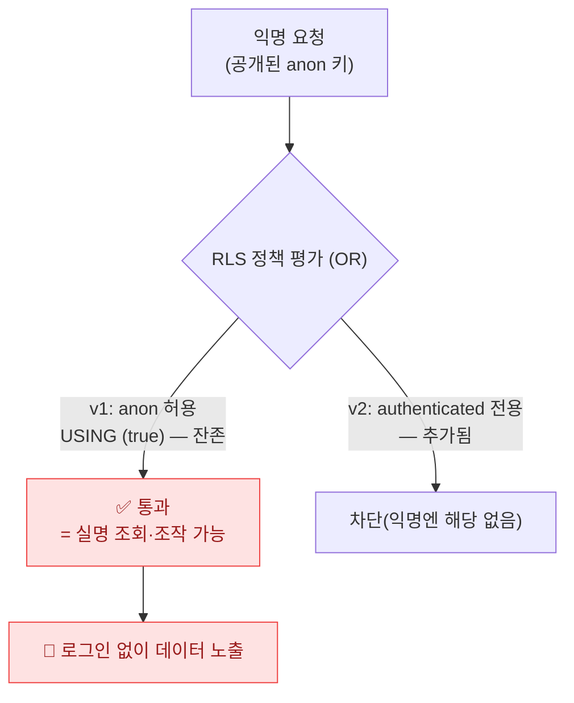
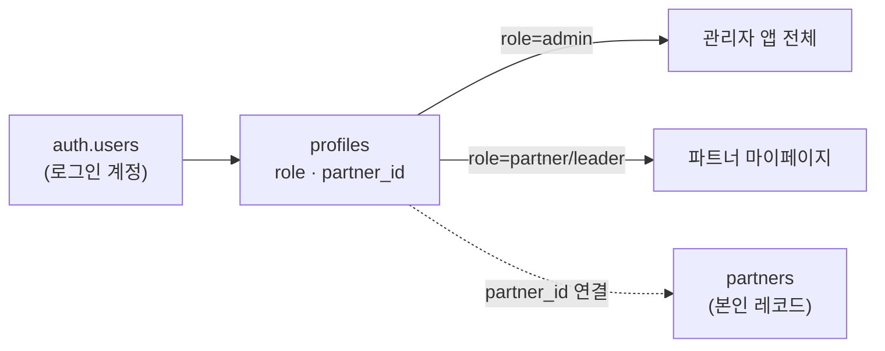
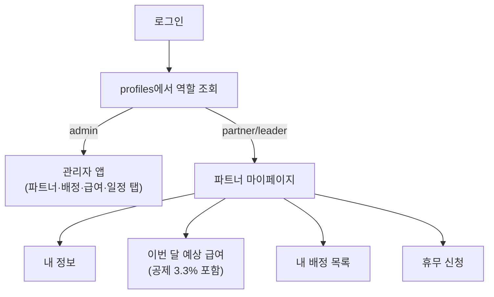
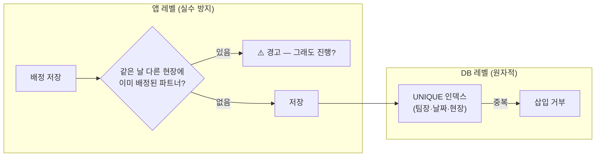
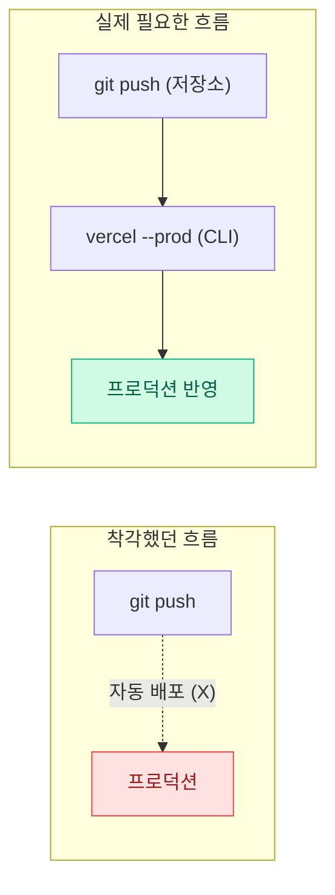
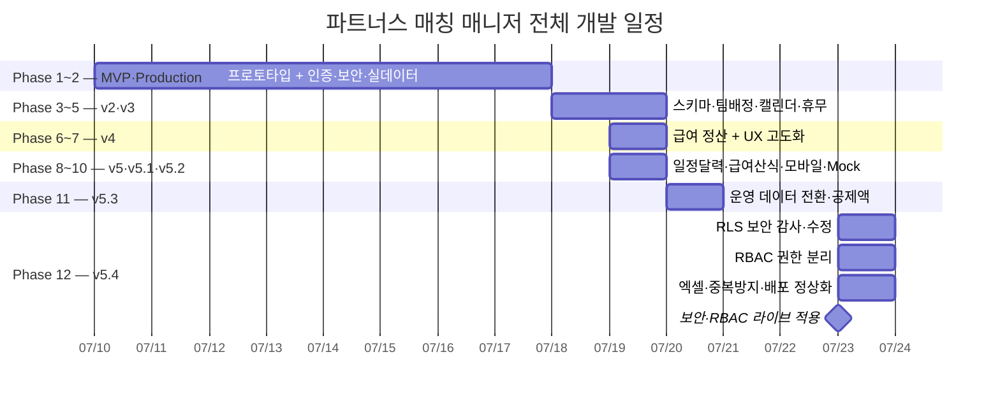

> 🏷️ **[NextX_AX_Solution]** · 주식회사 넥스트엑스(NEXT X) AX 솔루션 운영·유지보수 기록
{: .prompt-tip }

> 이 글은 파트너스 매칭 매니저 시리즈의 **열세 번째 글**입니다.
> 1. [프로토타입 제작기]() — MVP 개발
> 2. [실전 납품 개발기]() — 인증·보안·실데이터
> 3. [Auth 트러블슈팅]() — 로그인 오류 해결
> 4. [v2 업그레이드]() — 명부 교체·스키마 유연화
> 5. [v3 업그레이드]() — 팀 배정 시스템·캘린더 뷰
> 6. [v3.1 업그레이드]() — 휴무일 관리·스케줄 충돌 방지
> 7. [v4 업그레이드]() — 급여 정산 및 관리 시스템
> 8. [v4.1 업그레이드]() — UX 고도화 및 급여 기타수당
> 9. [v5 업그레이드]() — 통합 일정 관리 달력
> 10. [v5.1 업그레이드]() — 급여 산식 정밀화 및 모바일 카드 레이아웃
> 11. [v5.2 업그레이드]() — 엑셀 기반 Mock 데이터 파이프라인
> 12. [v5.3 업그레이드]() — 운영 데이터 전환 및 공제액 산식
> 13. **[현재 글] v5.4 업그레이드** — 보안 감사·권한 분리(RBAC)·엑셀
{: .prompt-info }

## 📋 업그레이드 배경

### 외부의 코드 리뷰, 그리고 "검증"

첫 상용 시스템이 전국으로 뻗어나가려면 성벽의 작은 틈새까지 벼려야 합니다. 이번엔 **외부 코드 리뷰**를 받아 구조와 보안을 점검했습니다. 리뷰의 지적은 날카로웠지만, 그중 일부는 **사실과 달랐습니다.** 그래서 첫 원칙을 세웠습니다:

> 코드 리뷰는 **실제 코드로 검증한 뒤** 행동한다. 잘못된 전제 위에서 작업하면, 멀쩡한 것을 고치고 진짜 문제는 놓친다.
{: .prompt-tip }

| 리뷰 지적 | 실제 코드 확인 결과 |
|------|------|
| "Firebase 키가 코드에 노출됨" | ❌ **Firebase 아님.** 이 시스템은 **Supabase** 사용 (`firebase` 흔적 0건) |
| "`.env`로 키 분리하고 `.gitignore`에 등록하라" | ✅ **이미 완료 상태**였음 (키는 `import.meta.env`로 로드, `.env` 미추적) |
| "키 노출 → DB 조작·과금 위험" | ⚠️ 방향은 옳지만 원인이 달랐음 — 진짜 문제는 **RLS 정책**에 있었다 |

리뷰가 지목한 "키"는 방향이 틀렸지만, **"익명 사용자가 DB를 조작할 수 있다"**는 우려 자체는 정확했습니다. 그 진짜 원인을 코드에서 찾아냈습니다.

---

## 🛡️ Phase 1 — 진짜 보안 구멍: RLS anon 정책 잔존

### 정책을 "추가"했지만 "제거"하지 않았다

이전 마이그레이션(v2)에서 로그인 사용자 전용 정책을 **추가**했습니다. 그런데 초기(v1)에 만든 **익명(anon) 허용 정책을 삭제하지 않았습니다.** PostgreSQL RLS는 여러 정책을 **OR**로 평가하기 때문에, anon 정책이 **하나라도 남아 있으면 문은 계속 열려 있습니다.**



정적 웹앱의 anon 키는 **설계상 공개되는 키**입니다(브라우저 번들에 포함). 그래서 실제 방어선은 오직 RLS인데, anon 정책이 남아 있으니 **누구나 로그인 없이 조회**할 수 있는 상태였습니다.

### 발견 → 실증 → 수정

가정하지 않고 **직접 확인**했습니다. 공개 anon 키로 로그인 없이 조회를 시도해 보니:

```
[수정 전] 익명 조회 → 200 OK, 데이터 노출 🔴
```

수정 마이그레이션으로 anon 정책을 **전부 제거**하고, 로그인 사용자(그리고 다음 단계의 역할)만 접근하도록 재정의했습니다. 같은 요청을 다시 던지니:

```
[수정 후] 익명 조회 → 200 OK, 0행 (RLS가 전부 필터링) ✅
```

```sql
-- 잔존하던 익명 허용 정책 제거 (핵심)
DROP POLICY IF EXISTS "Allow read partners"   ON partners;
DROP POLICY IF EXISTS "Allow insert partners" ON partners;
-- ... assignments 등 동일

-- 이후 단계에서 authenticated·역할 기반 정책으로 재정의
```

> 교훈: **정책 "추가"는 정책 "제거"가 아니다.** RLS는 OR 평가라 낡은 허용 정책 하나가 전체를 무력화한다. 마이그레이션은 "새 정책을 더한다"가 아니라 "정책 집합을 원하는 상태로 만든다"로 생각해야 한다.
{: .prompt-warning }

---

## 🔐 Phase 2 — 권한 분리(RBAC): 관리자 vs 파트너

보안 구멍을 막으면서, 이왕이면 **역할 기반 접근제어(RBAC)**까지 세웠습니다. 관리자만 쓰던 도구를, 파트너가 자기 정보를 보는 **플랫폼**으로 넓히는 첫걸음입니다.

### 데이터 모델 — profiles



- `profiles(id, role, partner_id)` — 로그인 계정 ↔ 역할 ↔ 파트너 연결
- 가입 시 트리거로 자동 생성(기본 `partner`), **기존 계정은 모두 `admin`으로 승격**(락아웃 방지)
- `is_admin()` / `my_partner_id()` 헬퍼 함수로 정책을 간결하게

### 역할별 RLS

```sql
-- 관리자: 전체
CREATE POLICY "partners admin all" ON partners
  FOR ALL TO authenticated USING (is_admin()) WITH CHECK (is_admin());

-- 파트너: 본인 레코드만
CREATE POLICY "partners self read" ON partners
  FOR SELECT TO authenticated USING (id = my_partner_id());

-- 급여: 관리자 전체 / 파트너는 본인 급여만
CREATE POLICY "payroll self read" ON payroll_records
  FOR SELECT TO authenticated USING (partner_id = my_partner_id());
```

> 핵심 원칙: **클라이언트의 역할은 UI 라우팅용일 뿐**이다. 브라우저가 "나 관리자야"라고 우겨도, 실제 데이터 접근은 서버의 RLS가 `auth.uid()` 기준으로 강제한다. 화면을 속여도 데이터는 못 가져간다.
{: .prompt-tip }

### 앱 라우팅 — 로그인 후 역할로 분기



파트너 마이페이지는 **본인 데이터만** 보여줍니다 — 내 배정, 이번 달 예상 급여(차인지급액까지), 휴무 신청. 관리자 UI(네비게이션·전체 패널)는 완전히 숨겨집니다.

---

## 📊 Phase 3 — 엑셀 입출력 & 중복 배정 방지

### 엑셀 (SheetJS, 동적 import)

70명이 넘는 인원과 월별 급여를 화면 클릭으로만 다루는 건 한계가 있어, 엑셀 입출력을 붙였습니다.

- **급여 명세 다운로드** — 파트너별 요약 + 레코드별 상세, 2개 시트로 1초 만에
- **파트너 대량 등록** — 엑셀 양식으로 일괄 등록(헤더 변형·기본값 자동 처리)

```javascript
// xlsx는 용량이 커서 클릭하는 순간에만 동적 로드 → 초기 번들 영향 0
async function xlsx() { return import('xlsx'); }
```

빌드 결과, `xlsx`는 **별도 청크**로 분리되어 초기 로딩 속도에 영향을 주지 않습니다.

### 중복 배정 방지 (동시성)

두 관리자가 동시에, 혹은 더블클릭으로 같은 파트너를 이중 배정하는 사고를 두 겹으로 막았습니다.



- **앱**: 이중 배정 시 경고(정말 필요하면 override 가능 — 하루 두 현장도 현실엔 있으니까)
- **DB**: `(leader_id, assignment_date, client_name, client_address)` UNIQUE 인덱스로 더블클릭·동시 제출을 **원자적으로** 차단

---

## 🚀 Phase 4 — 조용히 멈춰 있던 배포

기능을 다 만들고 `git push` 했는데, **라이브에 아무것도 반영되지 않았습니다.** 원인을 추적하니:

> 이 Vercel 프로젝트는 **GitHub 자동 배포가 연결돼 있지 않았다.** 그동안의 `git push`는 원격 저장소만 갱신했을 뿐, 프로덕션은 이전 상태 그대로였다.

라이브 사이트의 HTML을 확인해 최근 기능의 흔적이 **하나도 없다**는 걸 실증한 뒤, **CLI로 직접 배포**(`vercel --prod`)해 전부 반영했습니다.



> 교훈: **"push 했으니 배포됐겠지"를 믿지 말고, 라이브를 직접 확인하라.** 배포 파이프라인이 실제로 연결돼 있는지는 눈으로 검증해야 한다. 며칠간의 작업이 조용히 스테이징에만 머물러 있을 수 있다.
{: .prompt-warning }

---

## 📐 변경 사항 요약

| 항목 | 내용 |
|------|------|
| **보안** | RLS anon 정책 전면 제거 → 익명 접근 0건(실증). 급여 테이블 포함 전 테이블 역할 기반 |
| **RBAC** | `profiles` 테이블·역할별 RLS·가입 트리거·관리자 자동 승격 + 파트너 마이페이지 |
| **엑셀** | 급여 명세 다운로드(2시트) + 파트너 대량 등록, `xlsx` 동적 import |
| **동시성** | 이중 배정 앱 경고 + `(팀장·날짜·현장)` UNIQUE 인덱스 |
| **배포** | git push 자동배포 부재 발견 → CLI 배포로 전 기능 라이브 |
| **모듈화** | 엑셀 로직을 `src/excel.js`로 분리(단일 파일 비대화 완화의 첫걸음) |

---

## 💡 실전에서 배운 것

### 1. 리뷰는 검증하고 받아들여라
"Firebase 키 노출"이라는 지적을 그대로 따랐다면, 있지도 않은 파일을 찾다 시간을 버리고 **진짜 문제(RLS)는 놓쳤을** 것입니다. 리뷰의 **의도**(익명 접근 위험)는 맞았지만 **원인 진단**은 틀렸습니다. 코드로 확인한 뒤 행동하는 것이 답이었습니다.

### 2. 보안 정책은 "추가"가 아니라 "상태"로 관리하라
RLS는 OR 평가입니다. 새 정책을 더하는 것만으로는 낡은 허용 정책이 사라지지 않습니다. 마이그레이션은 "원하는 정책 집합"을 명시적으로 만들어야 합니다(불필요한 것은 `DROP`).

### 3. 권한은 클라이언트가 아니라 서버에서
화면 분기(관리자/파트너)는 UX일 뿐입니다. 실제 데이터 경계는 RLS가 지킵니다. 그래서 클라이언트 역할 판정이 느슨해도 데이터는 안전합니다.

### 4. 배포는 눈으로 확인하라
`git push`의 성공이 곧 프로덕션 반영은 아닙니다. 파이프라인 연결 여부를 실제 라이브로 검증하지 않으면, 완성한 기능이 사용자에게 도달하지 못한 채 며칠이 흐를 수 있습니다.

---

## 📈 시리즈 타임라인



---

## 🔗 프로젝트 링크

| 항목 | URL |
|------|-----|
| **라이브 서비스** | [partners-manager-omega.vercel.app](https://partners-manager-omega.vercel.app/) |
| **GitHub 소스코드** | [github.com/200gyu/partners-manager](https://github.com/200gyu/partners-manager) |
| **시리즈 #1** | [프로토타입 제작기]() |
| **시리즈 #11** | [v5.2 업그레이드]() |
| **시리즈 #12** | [v5.3 업그레이드]() |

---

## 🔮 다음 단계

v5.4로 시스템이 **더 안전하고, 역할이 분리된** 형태로 올라섰습니다.

| 기능 | 상태 | 다음 목표 |
|------|:---:|----------|
| RLS 보안 하드닝 | ✅ | 정기 보안 점검 자동화 |
| RBAC + 파트너 마이페이지 | ✅ | 파트너 계정 온보딩·팀장 권한 세분화 |
| 엑셀 입출력 | ✅ | 급여 명세 PDF·서명 |
| 중복 배정 방지 | ✅ | 근무시간 총량·거리 기반 배정 검증 |
| 알림 자동화(카카오 알림톡) | 🔜 | 카카오 비즈니스 채널 인증 후 배정 알림 발송 |
| AI 자동 매칭 | 🔜 | 지역·전문성·휴무·이력 기반 추천 |

> v5.4의 핵심은 "기능을 더 얹는 것"이 아니라 **"믿을 수 있는 시스템"으로 다지는 것**이었습니다. 외부 리뷰를 검증하는 태도, 보안을 실증으로 확인하는 습관, 배포를 눈으로 확인하는 규율 — 전국으로 뻗어나갈 성채에 가장 필요한 것은 화려한 탑이 아니라 **단단한 성벽**이니까요.
{: .prompt-tip }

---

*NEXT X R&D · AI Transformation*
