> **[NextX_Data_Solution]** · 주식회사 넥스트엑스(NEXT X) 정식 데이터 솔루션
{: .prompt-tip }

> [데이터 파이프라인]()에서 "데이터를 추출 → 변환 → 적재한다"고 했고, [ETL vs ELT]()에서 그 순서를 뒤집는 전략을 살펴봤습니다. 하지만 그 파이프라인이 **하루에 한 번** 돌면 충분할까요? 이번 글에서는 배치의 한계를 넘어, **발생 즉시 처리하는 스트리밍 세계**를 탐구합니다.
{: .prompt-info }

---

## 1. 배치 vs 스트리밍 -- 택배 vs 컨베이어 벨트

### 택배(배치)

"하루치 주문을 밤에 한꺼번에 박스에 담아 출고."

- 정해진 시간에 **한 덩어리(batch)** 로 처리
- 대표적인 배치 주기: 매 1시간, 매일 새벽 2시, 매주 월요일
- **장점** -- 구현 단순, 자원 효율적
- **단점** -- 데이터 **지연(latency)** 이 주기만큼 발생

### 컨베이어 벨트(스트리밍)

"물건이 올라오는 즉시 벨트 위에서 포장."

- 데이터가 발생하는 **즉시**(수 밀리초~수 초 이내) 처리
- **장점** -- 실시간 반응, 최신 데이터 즉시 활용
- **단점** -- 인프라 복잡도 증가, 운영 난이도 상승

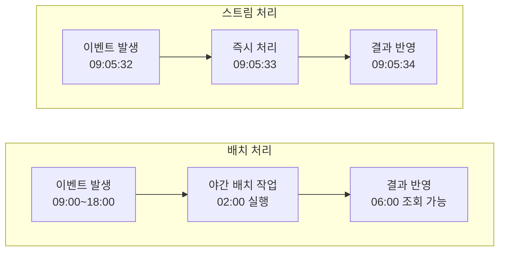

> 배치가 나쁘다는 뜻이 아닙니다. **"어제의 매출 합계"** 같은 분석은 배치로 충분합니다. 반면 **"지금 이 거래가 사기인가?"** 같은 질문은 1초가 생사를 가릅니다. 문제의 성격이 도구를 결정합니다.
{: .prompt-warning }

---

## 2. 이벤트(Event)란 -- "무언가 일어났다"는 신호

스트리밍의 출발점은 **이벤트(Event)** 입니다.

| 구분 | 설명 | 예시 |
|------|------|------|
| **정의** | 시스템에서 발생한 **상태 변화의 기록** | 사용자가 버튼을 클릭함, 센서 온도가 35도를 넘음 |
| **구조** | 보통 `{ 시간, 유형, 데이터 }` 형태 | `{ ts: "09:05:32", type: "order_placed", data: { ... } }` |
| **특성** | 한 번 발생하면 변경 불가(**불변, Immutable**) | 과거 기록은 수정하지 않고, 새 이벤트로 보정 |

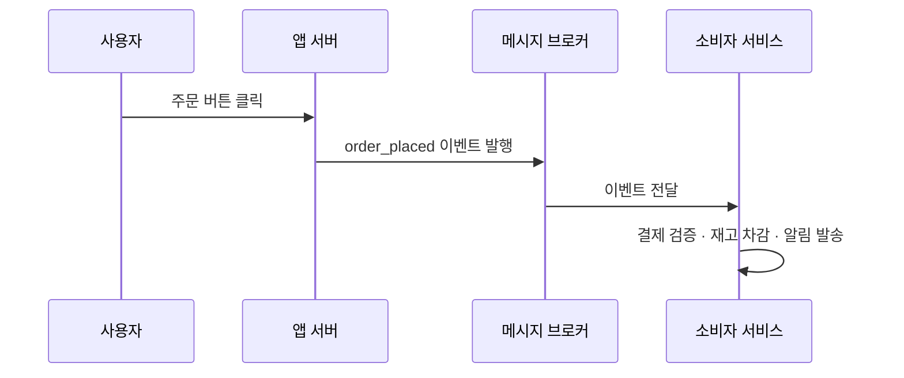

> [동기/비동기와 이벤트 루프]()에서 "이벤트를 큐에 넣고 루프가 꺼내 처리"하는 구조를 봤습니다. 스트리밍 아키텍처는 이 원리를 **분산 시스템 규모**로 확장한 것입니다.
{: .prompt-info }

### 이벤트와 메시지, 뭐가 다른가?

| | 이벤트(Event) | 메시지(Message) |
|---|---|---|
| 의미 | "이런 일이 일어났다" (사실 기록) | "이것을 해 달라" (명령/요청) |
| 발행자가 소비자를 아는가 | 모른다 (발행 후 잊음) | 보통 안다 (특정 큐로 보냄) |
| 1:N 전달 | 자연스러움 (여러 구독자) | 보통 1:1 |

실무에서는 두 개념이 혼용되기도 하지만, **"누가 받을지 발행자가 몰라도 되는가"** 를 기준으로 구분하면 설계가 명확해집니다.

---

## 3. 메시지 브로커 -- 이벤트의 우체국

이벤트를 **생산자(Producer)** 에서 **소비자(Consumer)** 로 안전하게 전달하는 중간 계층이 **메시지 브로커**입니다.

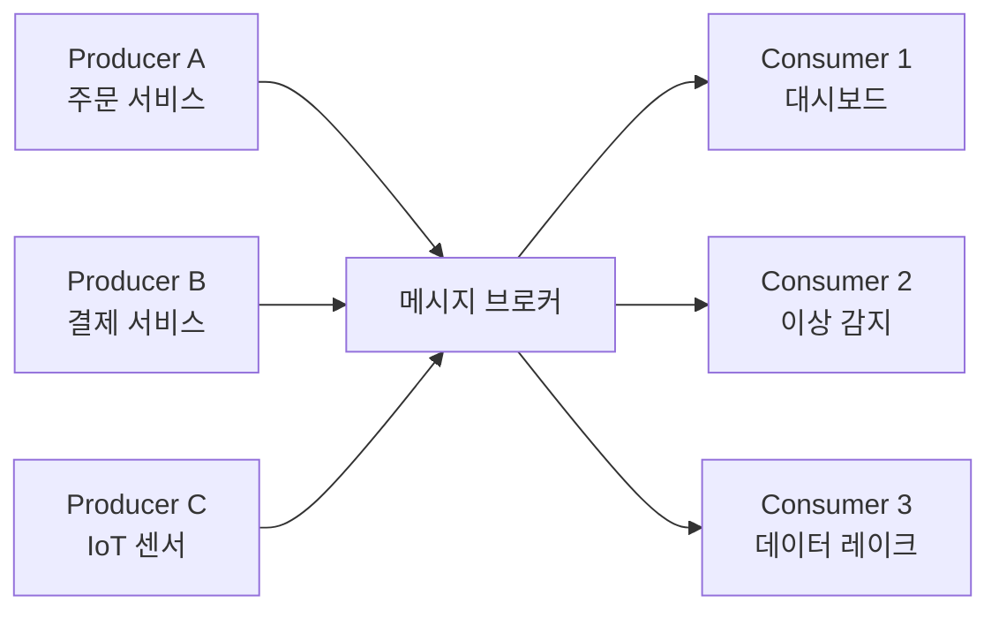

### 3-1. Apache Kafka

| 항목 | 내용 |
|------|------|
| **핵심 개념** | 분산 **로그 저장소**. 이벤트를 디스크에 순서대로 쌓고, 여러 소비자가 각자의 속도로 읽음 |
| **토픽(Topic)** | 이벤트를 분류하는 채널 (예: `orders`, `payments`, `sensor-temp`) |
| **파티션(Partition)** | 토픽을 분할해 **병렬 처리** 가능하게 함 |
| **보존 기간** | 이벤트를 읽은 후에도 설정한 기간만큼 **삭제하지 않고** 보관 |
| **적합한 상황** | 대용량, 높은 처리량, 이벤트 재처리(Replay)가 필요할 때 |

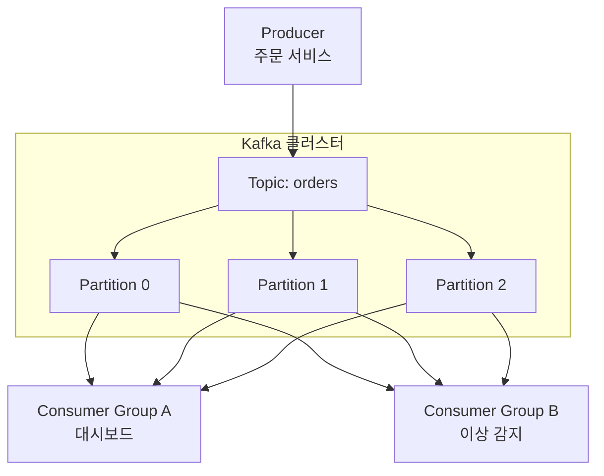

> Kafka의 가장 큰 특징은 **"읽어도 지우지 않는다"** 는 점입니다. 덕분에 새로운 소비자를 나중에 추가해도 **과거 이벤트를 처음부터 다시 읽을 수(Replay)** 있습니다. [데이터 웨어하우스 vs 레이크]()에서 다룬 데이터 레이크에 이벤트 로그를 통째로 쌓는 패턴과도 잘 어울립니다.
{: .prompt-tip }

### 3-2. RabbitMQ

| 항목 | 내용 |
|------|------|
| **핵심 개념** | 전통적인 **메시지 큐**. 소비자가 메시지를 읽으면 큐에서 제거 |
| **라우팅** | Exchange → Binding → Queue 구조로 유연한 라우팅 |
| **프로토콜** | AMQP 표준 |
| **적합한 상황** | 작업 분배(Task Queue), 요청-응답 패턴, 메시지 단위의 정확한 처리 보장 |

### 3-3. Google Cloud Pub/Sub

| 항목 | 내용 |
|------|------|
| **핵심 개념** | 완전 관리형 **발행/구독** 서비스 |
| **관리 부담** | 서버 관리 불필요 (서버리스) |
| **자동 확장** | 트래픽에 따라 자동 스케일링 |
| **적합한 상황** | GCP 생태계, 인프라 운영 인력이 적은 조직 |

### 브로커 비교표

| 기준 | Kafka | RabbitMQ | Google Pub/Sub |
|------|-------|----------|---------------|
| 모델 | 로그 기반 (이벤트 보존) | 큐 기반 (소비 후 삭제) | 관리형 발행/구독 |
| 처리량 | 초당 수백만 건 | 초당 수만 건 | 자동 확장 |
| 메시지 보존 | 설정 기간 동안 보관 | 소비 시 삭제 | 7일(기본) |
| 운영 복잡도 | 높음 (ZooKeeper/KRaft) | 중간 | 낮음 (서버리스) |
| 이벤트 재처리 | 용이 (오프셋 리셋) | 어려움 | 가능 (Seek) |
| 비용 구조 | 인프라 직접 관리 | 인프라 직접 관리 | 사용량 기반 과금 |

---

## 4. 스트림 처리 엔진 -- 흐르는 데이터 위의 공장

메시지 브로커가 **운반**을 담당한다면, 스트림 처리 엔진은 그 위에서 **집계, 변환, 패턴 감지** 같은 **연산**을 수행합니다.

### 4-1. Apache Flink

Flink는 **진정한 스트림(True Streaming)** 엔진입니다.

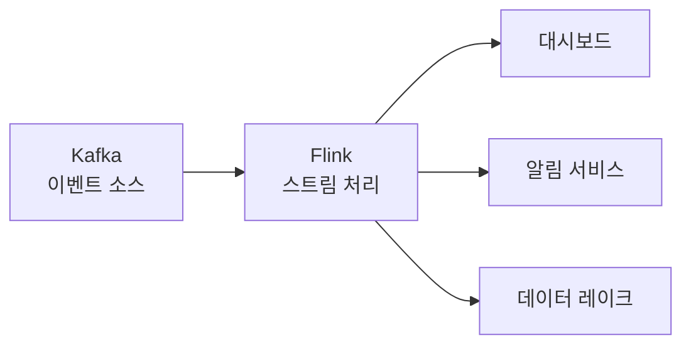

| 특징 | 설명 |
|------|------|
| **이벤트 단위 처리** | 마이크로배치가 아닌 이벤트 하나씩 처리 |
| **이벤트 시간(Event Time)** | 이벤트가 **실제 발생한 시각** 기준으로 처리 (늦게 도착해도 정확) |
| **정확히 한 번(Exactly-Once)** | 장애 복구 후에도 중복 없이 정확히 한 번 처리 보장 |
| **상태 관리(Stateful)** | 5분 평균, 누적 합계 등 **중간 상태를 메모리에 보관**하며 처리 |
| **체크포인트** | 상태를 주기적으로 스냅샷 → 장애 시 해당 지점부터 복구 |

> **이벤트 시간 vs 처리 시간** -- 센서가 09:05:00에 데이터를 생성했지만 네트워크 지연으로 09:05:10에 도착했다면? 이벤트 시간 기반 처리는 09:05:00 기준으로 정확하게 집계합니다. 이것이 Flink의 핵심 강점입니다.
{: .prompt-info }

### 4-2. Spark Structured Streaming

| 특징 | 설명 |
|------|------|
| **마이크로배치 기반** | 짧은 간격(수백 ms~수 초)의 미니 배치를 반복 |
| **Spark 생태계 활용** | 배치·ML·SQL과 동일한 API로 스트리밍 처리 |
| **적합한 상황** | 이미 Spark 기반 배치 파이프라인이 있는 조직 |

### 4-3. Kafka Streams

| 특징 | 설명 |
|------|------|
| **라이브러리 형태** | 별도 클러스터 없이 **애플리케이션 내장**으로 실행 |
| **Kafka 네이티브** | Kafka 토픽을 입력/출력으로 직접 사용 |
| **적합한 상황** | 간단한 실시간 변환, Kafka 중심 아키텍처 |

### 스트림 처리 엔진 비교

| 기준 | Flink | Spark Streaming | Kafka Streams |
|------|-------|-----------------|---------------|
| 처리 모델 | 진정한 스트림 | 마이크로배치 | 진정한 스트림 |
| 지연 시간 | 밀리초 | 초~분 | 밀리초 |
| 상태 관리 | 강력 (RocksDB) | 제한적 | 중간 (RocksDB) |
| 배포 방식 | 전용 클러스터 | Spark 클러스터 | 애플리케이션 내장 |
| 학습 곡선 | 가파름 | 중간 (Spark 경험 시 쉬움) | 낮음 |
| 배치 겸용 | 가능 | 강점 | 불가 |

---

## 5. 이벤트 기반 아키텍처 패턴

이벤트를 중심에 놓고 시스템을 설계하는 대표적인 패턴 두 가지를 살펴봅니다.

### 5-1. 이벤트 소싱(Event Sourcing)

**현재 상태를 저장하는 대신, 발생한 모든 이벤트를 순서대로 저장**하는 패턴입니다.

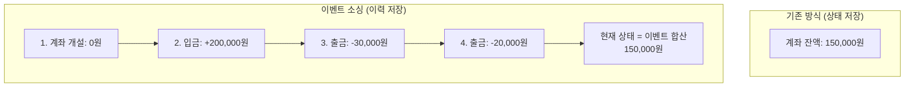

| 장점 | 설명 |
|------|------|
| **완전한 이력** | 언제, 왜, 어떻게 바뀌었는지 추적 가능 |
| **시간 여행** | 특정 시점의 상태를 이벤트 재생으로 복원 |
| **감사(Audit) 용이** | 금융, 의료 등 규제 산업에서 필수 |

| 단점 | 설명 |
|------|------|
| **복잡성 증가** | 이벤트 스키마 버전 관리 필요 |
| **조회 성능** | 현재 상태를 매번 재계산하면 느림 → CQRS로 해결 |

### 5-2. CQRS (Command Query Responsibility Segregation)

**쓰기(Command)** 와 **읽기(Query)** 의 모델을 분리하는 패턴입니다. 이벤트 소싱과 자주 함께 사용됩니다.

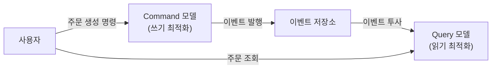

| 구분 | Command (쓰기) | Query (읽기) |
|------|---------------|-------------|
| 최적화 방향 | 데이터 무결성·비즈니스 규칙 | 빠른 조회·다양한 뷰 |
| 저장소 | 이벤트 로그, 정규화 DB | 역정규화 DB, 캐시, 검색 엔진 |
| 예시 | "주문 생성", "재고 차감" | "내 주문 목록", "이번 달 매출" |

> CQRS는 무조건 좋은 것이 아닙니다. 쓰기와 읽기 모델 사이에 **일시적 불일치(Eventual Consistency)** 가 생기므로, 이를 허용할 수 있는 서비스에만 적용해야 합니다.
{: .prompt-warning }

---

## 6. 실전 사례 -- 실시간 처리가 빛나는 순간

### 6-1. 실시간 대시보드

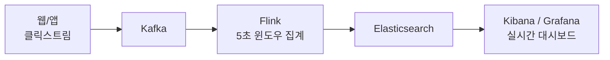

- **목표** -- 현재 접속자 수, 실시간 매출, 전환율을 **초 단위**로 모니터링
- **배치의 한계** -- "어제 매출은 알지만, 지금 진행 중인 프로모션 효과는 내일 알 수 있다"
- **스트리밍 효과** -- 프로모션 개시 30초 후부터 전환율 변화를 실시간 확인

### 6-2. 이상 감지(Anomaly Detection)

| 적용 분야 | 감지 대상 | 허용 지연 |
|-----------|----------|----------|
| 금융 | 이상 거래 (FDS) | 수 밀리초 |
| 보안 | 비정상 로그인 시도 | 수 초 |
| 제조 | 설비 진동 이상 | 수 초 |
| 네트워크 | DDoS 트래픽 급증 | 수 초 |

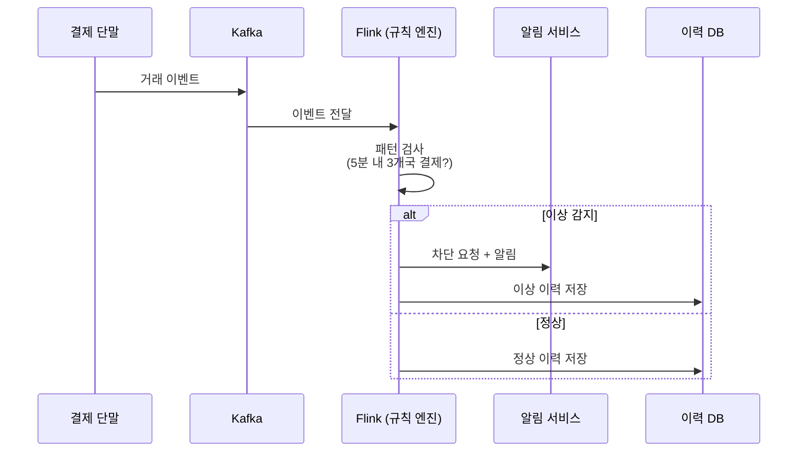

### 6-3. IoT 데이터 처리

수백~수만 개의 센서가 **동시에** 데이터를 전송합니다.

| 도전 과제 | 해결 방법 |
|----------|----------|
| 대량의 소규모 메시지 | Kafka 파티셔닝으로 병렬 수집 |
| 네트워크 불안정 | 로컬 버퍼링 후 재전송 (Edge 처리) |
| 실시간 집계 | Flink 윈도우 연산 (1분 평균, 5분 최대) |
| 장기 보관 | 집계 결과만 데이터 레이크에 적재 |

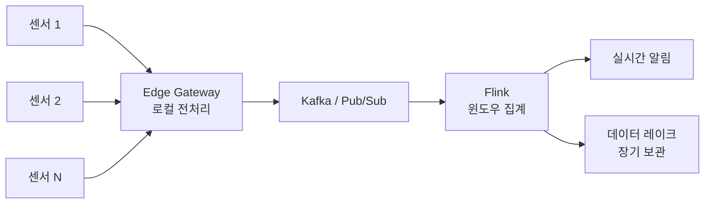

### 6-4. 실시간 추천 시스템

사용자의 **지금 이 순간** 행동을 반영하는 추천입니다.

- 배치 추천: "어제까지의 구매 이력 → 매일 새벽 모델 업데이트"
- 실시간 추천: "방금 본 상품 + 현재 장바구니 → **즉시** 추천 변경"

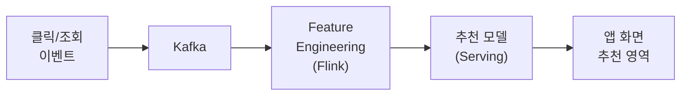

> [임베딩 & 벡터 DB]()에서 다룬 벡터 유사도 검색을 실시간 피처와 결합하면, 사용자의 현재 맥락을 반영하는 추천이 가능합니다.
{: .prompt-info }

---

## 7. 배치 vs 마이크로배치 vs 스트리밍 비교표

| 기준 | 배치(Batch) | 마이크로배치(Micro-batch) | 스트리밍(Streaming) |
|------|------------|------------------------|-------------------|
| 처리 단위 | 시간/일 단위 데이터 묶음 | 수백 ms~수 초 분량의 작은 묶음 | 이벤트 1건씩 |
| 지연 시간 | 분~시간~일 | 초~분 | 밀리초~초 |
| 처리량 | 매우 높음 | 높음 | 높음 (도구에 따라) |
| 구현 복잡도 | 낮음 | 중간 | 높음 |
| 정확성 보장 | 쉬움 (전체 데이터 확인) | 중간 | 어려움 (Exactly-Once 필요) |
| 상태 관리 | 불필요 | 제한적 | 필수 (윈도우, 카운터 등) |
| 장애 복구 | 재실행 | 부분 재실행 | 체크포인트 기반 복구 |
| 대표 도구 | Spark Batch, Airflow, dbt | Spark Streaming | Flink, Kafka Streams |
| 적합한 업무 | 일/주/월 리포트, 대규모 ETL | 준실시간 대시보드 | FDS, IoT, 실시간 추천 |

```mermaid
flowchart LR
    subgraph 지연["데이터 지연 스펙트럼"]
        direction LR
        BATCH["배치<br/>시간~일"] ---|마이크로배치<br/>초~분| MICRO[""]
        MICRO ---|스트리밍<br/>밀리초~초| STREAM[""]
    end

    style BATCH fill:#f9d6d5,stroke:#333
    style MICRO fill:#fef3c7,stroke:#333
    style STREAM fill:#d1fae5,stroke:#333
```

> 현실에서는 **람다 아키텍처(Lambda Architecture)** 처럼 배치와 스트리밍을 **함께** 운영하는 경우가 많습니다. 스트리밍으로 실시간 근사값을 제공하고, 배치로 정확한 보정값을 후처리합니다.
{: .prompt-tip }

---

## 8. "우리 회사에 실시간 처리가 필요한가?" -- 판단 기준

실시간 처리는 강력하지만, **모든 조직에 필요한 것은 아닙니다.** 잘못 도입하면 복잡성만 늘고 효과는 미미합니다.

### 도입이 필요한 신호

| 신호 | 예시 |
|------|------|
| **"지금" 이 중요한 의사결정** | 실시간 사기 탐지, 재고 부족 즉시 알림 |
| **사용자 경험이 지연에 민감** | 라이브 피드, 실시간 알림, 추천 |
| **데이터 양이 연속적이고 끊이지 않음** | IoT 센서, 클릭스트림, 로그 |
| **배치 주기 단축만으로 불충분** | 1시간 배치 → 5분 배치 → 그래도 부족 |

### 배치로 충분한 상황

| 상황 | 이유 |
|------|------|
| 일/주/월 단위 리포트 | 어제의 데이터로 충분 |
| 분석 쿼리 중심 | 대화형 쿼리(BigQuery 등)가 더 효율적 |
| 데이터 소스 자체가 배치 | 엑셀 업로드, 월 1회 제공 파일 |
| 팀 규모가 작고 운영 여력 부족 | 스트리밍 인프라 운영 부담이 큼 |

### 판단 플로차트

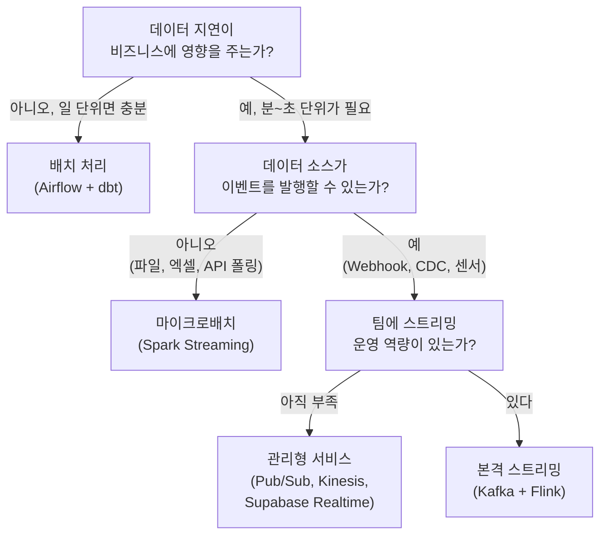

> 실시간 처리 도입의 가장 큰 함정은 **"기술적으로 가능하니까"** 라는 이유로 시작하는 것입니다. **"이 지연이 매출/안전/UX에 얼마만큼의 영향을 주는가?"** 를 먼저 정량화하세요.
{: .prompt-warning }

---

## 9. Supabase Realtime -- 소규모에서의 실시간 구독

Kafka + Flink 조합은 강력하지만, **1~5인 팀**이 운영하기엔 과합니다. 소규모 팀이 빠르게 실시간 기능을 구현할 수 있는 도구가 있습니다.

### Supabase Realtime이란?

[Supabase](https://supabase.com/)는 Firebase의 오픈소스 대안으로, PostgreSQL 위에 **인증, 스토리지, 실시간 구독** 기능을 얹은 BaaS(Backend as a Service)입니다.

| 기능 | 설명 |
|------|------|
| **Postgres Changes** | DB 테이블의 INSERT/UPDATE/DELETE를 **WebSocket으로 실시간 수신** |
| **Broadcast** | 클라이언트 간 **실시간 메시지 전송** (채팅, 커서 위치 공유) |
| **Presence** | 현재 접속 중인 사용자 목록 실시간 동기화 |

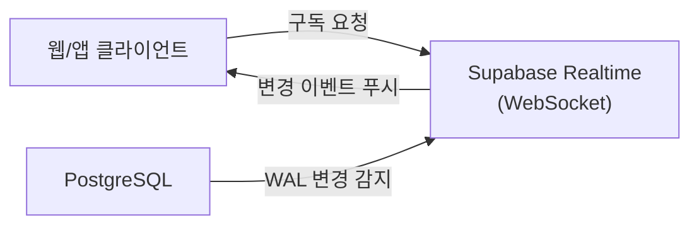

### 코드 예시 -- 주문 테이블 실시간 구독

```javascript
import { createClient } from '@supabase/supabase-js'

const supabase = createClient(SUPABASE_URL, SUPABASE_KEY)

// 'orders' 테이블의 INSERT 이벤트 실시간 구독
const channel = supabase
  .channel('orders-realtime')
  .on(
    'postgres_changes',
    { event: 'INSERT', schema: 'public', table: 'orders' },
    (payload) => {
      console.log('새 주문:', payload.new)
      updateDashboard(payload.new)   // 대시보드 즉시 갱신
    }
  )
  .subscribe()
```

### Kafka vs Supabase Realtime

| 기준 | Kafka + Flink | Supabase Realtime |
|------|-------------|------------------|
| 대상 규모 | 대규모 (수백만 이벤트/초) | 소규모 (수천 이벤트/초) |
| 인프라 관리 | 직접 (또는 Confluent Cloud) | 서버리스 (Supabase 호스팅) |
| 데이터 소스 | 다양한 프로듀서 | PostgreSQL 테이블 변경 |
| 클라이언트 전달 | 별도 구현 필요 | WebSocket 내장 |
| 이벤트 보존 | 장기 보관 가능 | DB에 행으로 보존 |
| 학습 비용 | 높음 | 낮음 |
| 월 비용 (시작) | 수십~수백만 원 | 무료~수만 원 |

> Supabase Realtime은 **"완전한 스트리밍 아키텍처"** 는 아니지만, 내부 대시보드, 소규모 알림 시스템, 협업 도구 등에서 배치 폴링을 없애고 **즉각적인 UX**를 만들기에 충분합니다. 인프라 부담 없이 실시간의 맛을 볼 수 있는 첫걸음입니다.
{: .prompt-tip }

---

## 10. 윈도우(Window) -- 끝없는 스트림을 구간으로 자르기

스트리밍에서 "최근 5분 평균"이나 "1시간 내 최대값" 같은 집계를 하려면, 무한한 데이터 흐름을 **유한한 구간**으로 잘라야 합니다. 이 구간을 **윈도우(Window)** 라고 합니다.

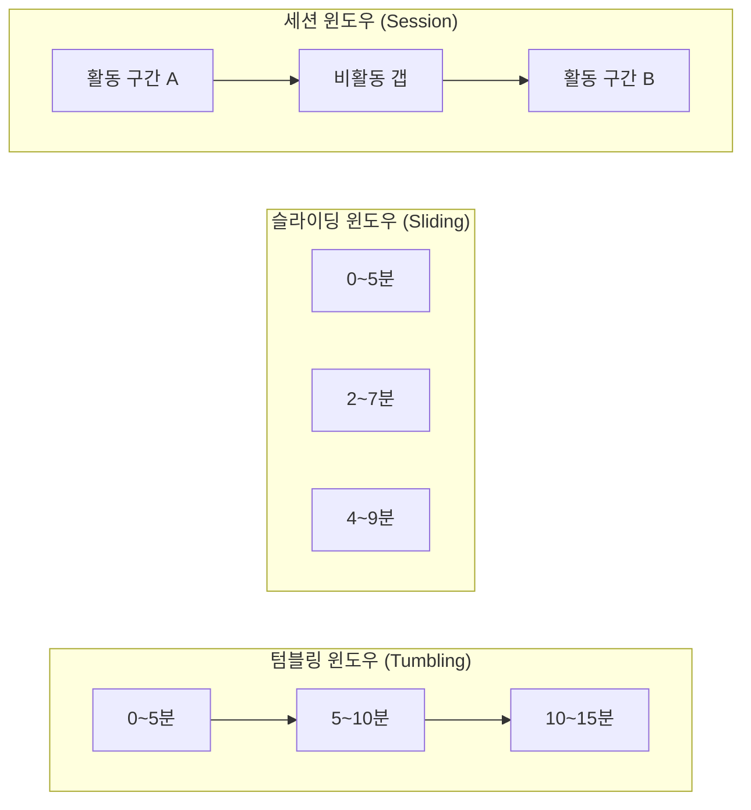

| 윈도우 유형 | 설명 | 사용 예시 |
|------------|------|----------|
| **텀블링(Tumbling)** | 겹치지 않는 고정 구간 | 5분마다 평균 온도 |
| **슬라이딩(Sliding)** | 겹치는 구간 (크기 + 슬라이드 간격) | 5분 윈도우를 1분마다 계산 |
| **세션(Session)** | 활동 기반 동적 구간 (비활동 시 종료) | 사용자 세션별 클릭 수 |

---

## 11. 실시간 파이프라인 전체 그림

지금까지 다룬 구성 요소를 하나의 아키텍처로 연결하면 다음과 같습니다.

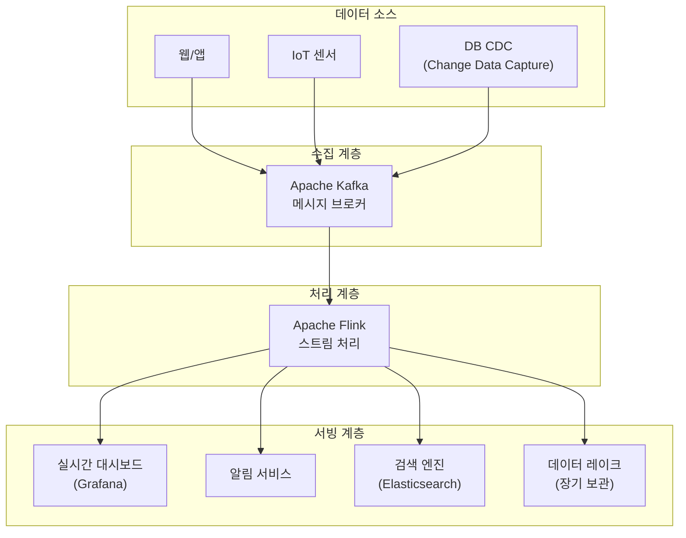

> [데이터 파이프라인]()에서 다룬 ETL 파이프라인과 비교해 보세요. 배치에서는 Airflow가 "오케스트레이터" 역할을 했다면, 스트리밍에서는 **Kafka가 데이터 흐름의 중심축**, **Flink가 처리 엔진** 역할을 합니다.
{: .prompt-info }

---

## 12. 시작하기 위한 실전 로드맵

스트리밍을 처음 도입하는 팀을 위한 단계별 로드맵입니다.

| 단계 | 활동 | 도구 예시 |
|------|------|----------|
| **1단계** | 배치 파이프라인 안정화 | Airflow, dbt |
| **2단계** | 실시간이 필요한 유스케이스 1개 선정 | -- |
| **3단계** | 관리형 서비스로 PoC | Supabase Realtime, Cloud Pub/Sub |
| **4단계** | 이벤트 스키마 표준 정의 | Avro, Protobuf, JSON Schema |
| **5단계** | Kafka 도입 (관리형 권장) | Confluent Cloud, Amazon MSK |
| **6단계** | 스트림 처리 엔진 도입 | Flink (Amazon Managed Flink) |
| **7단계** | 배치 + 스트리밍 통합 운영 | Lakehouse 패턴 |

> 1단계를 건너뛰지 마세요. 배치 파이프라인이 불안정한 상태에서 스트리밍을 얹으면, 두 시스템 모두 관리할 수 없게 됩니다. [ETL vs ELT]()에서 다룬 기초 파이프라인을 먼저 다지는 것이 순서입니다.
{: .prompt-warning }

---

## 핵심 요약

| 개념 | 한 줄 정리 |
|------|-----------|
| **배치** | 모아서 한 번에 처리 -- 단순하고 효율적 |
| **스트리밍** | 발생 즉시 처리 -- 실시간 반응, 복잡도 증가 |
| **이벤트** | "무언가 일어났다"는 불변의 기록 |
| **메시지 브로커** | 이벤트를 안전하게 전달하는 중간 계층 (Kafka, Pub/Sub) |
| **스트림 처리 엔진** | 흐르는 데이터 위에서 집계/변환 수행 (Flink, Spark) |
| **이벤트 소싱** | 상태 대신 이벤트 이력을 저장하는 패턴 |
| **CQRS** | 쓰기와 읽기 모델을 분리하는 패턴 |
| **윈도우** | 무한한 스트림을 유한한 구간으로 자르는 기법 |
| **판단 기준** | "이 지연이 비즈니스에 얼마만큼의 손해인가?" |

---

## 함께 읽기

- [데이터 파이프라인이란?]() -- 파이프라인의 기본 개념과 ETL 단계
- [ETL vs ELT]() -- 변환 순서가 만드는 아키텍처의 차이
- [데이터 웨어하우스 vs 레이크]() -- 저장소 선택 전략
- [동기/비동기와 이벤트 루프]() -- 이벤트 기반 처리의 프로그래밍 원리
- [임베딩 & 벡터 DB]() -- 실시간 추천과 연결되는 벡터 검색

---

*NEXT X R&D · Data Engineering*
