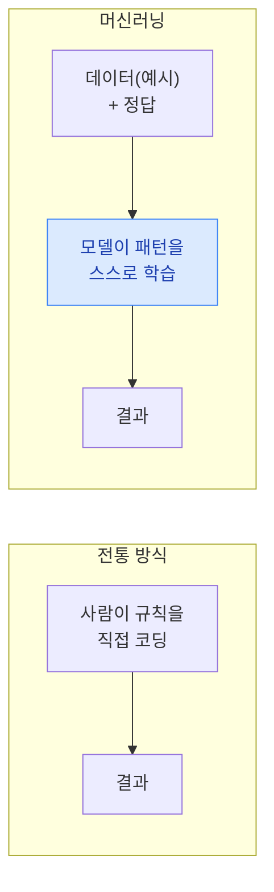
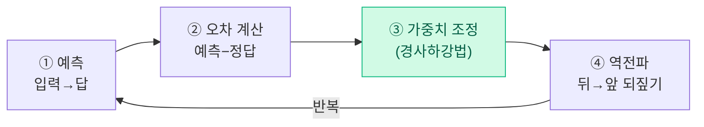
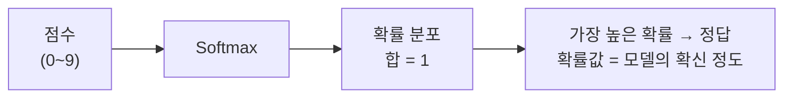
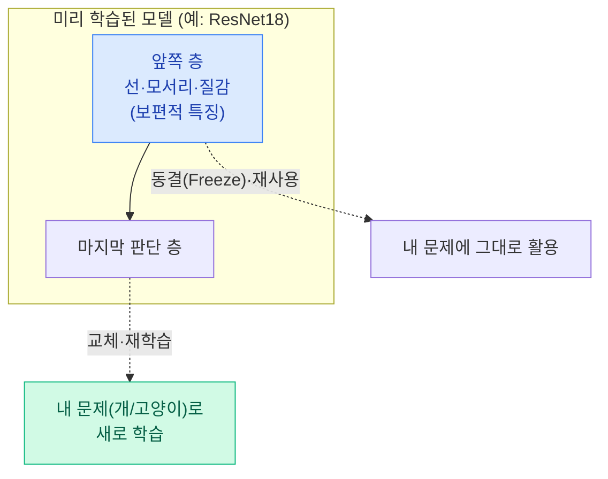

> 🏷️ **[NextX_R&D_Log]** · 모두의연구소 아이펠(AIFFEL) AI 에이전트 1기 학습 정리
{: .prompt-tip }

> "AI는 어떻게 배울까?" — 이 한 편이면 머신러닝의 학습 원리를 큰 그림으로 잡을 수 있습니다.
> 수식보다 **직관**에 집중해, 비개발자도 끝까지 따라올 수 있게 정리했습니다.
{: .prompt-info }

## 1. 인공지능의 학습이란?

### 규칙을 짜는 기계 ➡️ 배우는 기계

예전에는 사람이 **예외 조건을 하나하나 코딩**했습니다("이러면 스팸, 저러면 정상…"). 하지만 세상의 경우의 수는 너무 많죠. 그래서 접근을 뒤집었습니다 — **컴퓨터에게 예시(데이터)를 잔뜩 주고, 규칙을 스스로 찾게** 만든 것. 이것이 머신러닝입니다.



- **지도학습(Supervised Learning)**: **입력 데이터 + 정답(라벨)**의 쌍을 주고 학습시키는 가장 기본 방식.

### 학습의 핵심 메커니즘 — 예측 → 오차 → 조정 → 역전파

모델은 아래 루프를 **오차가 충분히 작아질 때까지 수없이 반복**하며 똑똑해집니다.



1. **예측** — 모델이 입력을 보고 답을 냅니다.
2. **오차 계산** — 예측과 정답의 차이를 잽니다.
3. **가중치 조정(경사하강법)** — 오차를 줄이는 방향으로 내부 수치(가중치)를 **아주 조금씩** 고칩니다. (산에서 안개 속을 더듬어 가장 낮은 곳으로 한 발씩 내려가는 것과 같습니다.)
4. **역전파(Backpropagation)** — 여러 층으로 된 신경망에서, 오차를 **뒤에서 앞으로 되짚어** 각 가중치를 얼마나 고칠지 알려주는 기술.

> 핵심: 학습이란 결국 **"틀린 만큼 조금씩 고치기"의 무한 반복**입니다.
{: .prompt-tip }

---

## 2. 데이터를 숫자로 바꾸기 — 임베딩과 텐서

컴퓨터는 **숫자만** 이해합니다. 그래서 모든 데이터는 숫자로 변환되어야 합니다.

- **글자(텍스트)**: 문장을 **토큰(Token)**으로 자른 뒤, 의미를 담은 숫자 묶음인 **벡터(Vector)**로 바꿉니다. 이렇게 하면 단어가 "의미 공간의 한 점"이 됩니다 → 이를 **임베딩(Embedding)**이라 부릅니다.
- **그림(이미지)**: 픽셀의 밝기·색상 값을 **숫자 격자**로 변환합니다.

### 차원의 사다리 (텐서)

| 차원 | 이름 | 모양 | 예시 |
|:---:|------|------|------|
| 0차 | 스칼라 | 숫자 1개 | `5` |
| 1차 | 벡터 | 숫자 한 줄 | 단어 임베딩 `[0.2, -1.1, …]` |
| 2차 | 행렬 | 숫자 격자 | 흑백 이미지 |
| 3차+ | 텐서 | 격자를 여러 장 쌓음 | 컬러 이미지(R/G/B 3장) |

> **텐서(Tensor)**는 이 "숫자 덩어리"의 일반 이름입니다. 딥러닝은 결국 이 텐서들을 곱하고 더하는 과정입니다.
{: .prompt-info }

---

## 3. 회귀 vs 분류 — 문제의 두 유형

### 📈 회귀(Regression) — "얼마나?"

**연속된 수치**를 맞히는 문제입니다. 예: 카페 방문객 수로 매출 예측.

```
매출(y) = 기울기(w) × 방문객수(x) + 절편(b)
```

방문객 수(`x`)와 매출(`y`)의 관계를 직선으로 나타낼 때, 오차를 줄여가며 최적의 **기울기(`w`)**와 **절편(`b`)**을 찾아냅니다.

### 🏷️ 분류(Classification) — "어느 것?"

여러 후보 중 **어느 범주에 속하는지** 고르는 문제입니다. 예: MNIST 손글씨 숫자(0~9) 구분.

- **Softmax(소프트맥스)**: 각 후보에 대한 점수를 **"합이 1이 되는 확률"**로 바꿔주는 장치.



가장 높은 확률의 후보를 답으로 고르고, 그 확률값으로 **모델이 얼마나 확신하는지**까지 알 수 있습니다.

---

## 4. 남이 배운 것을 물려받기 — 파인튜닝(Fine-Tuning)

밑바닥부터 학습시키려면 데이터도 시간도 어마어마합니다. 그래서 **이미 잘 학습된 모델의 지식을 물려받습니다** — 이것이 **전이학습(Transfer Learning)**.



- 신경망 **앞쪽 층**은 선·모서리·질감 같은 **보편적 시각 특징**을 봅니다 → **동결(Freeze)**하여 그대로 재사용.
- **마지막 판단 층**만 내 문제(예: 개/고양이)에 맞게 새로 학습.
- **장점**: 데이터·계산 자원이 적어도 **높은 성능**.

---

## 5. 하드웨어와 규모의 현실 — GPU와 Colab CLI

### 왜 GPU가 필수인가?

딥러닝 학습은 **방대한 행렬 곱셈의 연속**입니다.

| | 처리 방식 | 딥러닝에서 |
|---|---|---|
| **CPU** | 복잡한 일을 **순서대로** | 느림 |
| **GPU** | 수천 개 코어로 단순 계산을 **한꺼번에(병렬)** | 수십~수백 배 빠름 |

- **Colab CLI**: 구글 코랩의 GPU 환경을 **브라우저 없이 터미널 한 줄**로 다루고 자동 반납하는 공식 도구. AI 코딩 에이전트가 클라우드 GPU를 직접 활용하도록 시킬 때 특히 유용합니다.

---

## 💡 최종 요약 — "결국 데이터가 전부다"

> 화려한 모델 구조보다 **양질의 데이터**가 성능을 좌우합니다. 데이터를 10%로 줄이면 정확도는 급격히 떨어집니다.
{: .prompt-warning }

1. **모델보다 데이터** — 좋은 데이터를 모으고 검증하는 것이 핵심.
2. **AI 활용가의 역할** — 코드를 직접 짜는 것보다, **"어떤 데이터를 주고 · 어떤 학습을 시키고 · 결과를 어떻게 검증할지"** 판단하는 직관이 더 중요합니다.

이 관점은 넥스트엑스가 AX 솔루션을 만들 때의 원칙과도 닿아 있습니다 — [RAG 쉽게 이해하기]()나 [임베딩 & 벡터 DB]()와 함께 읽으면 "데이터를 숫자로 바꿔 다루는" 큰 그림이 이어집니다.

---

> 📎 본 글은 **주식회사 넥스트엑스(NEXT X) 기술연구소**의 학습 기록(R&D Log)입니다.
> **함께 읽기** — [🧠 RAG 쉽게 이해하기]() · [🔢 임베딩 & 벡터 DB]() · [📖 블로그 안내]()
{: .prompt-info }
