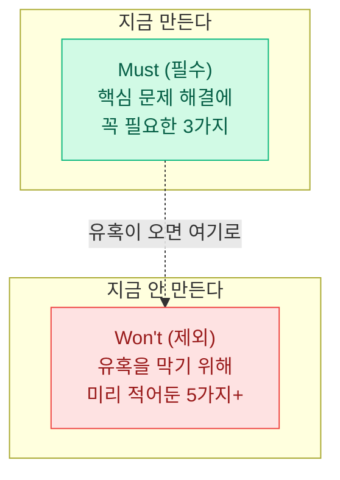
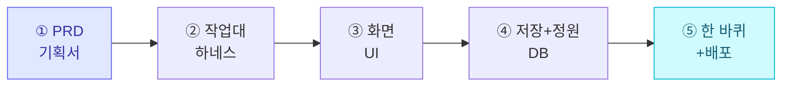
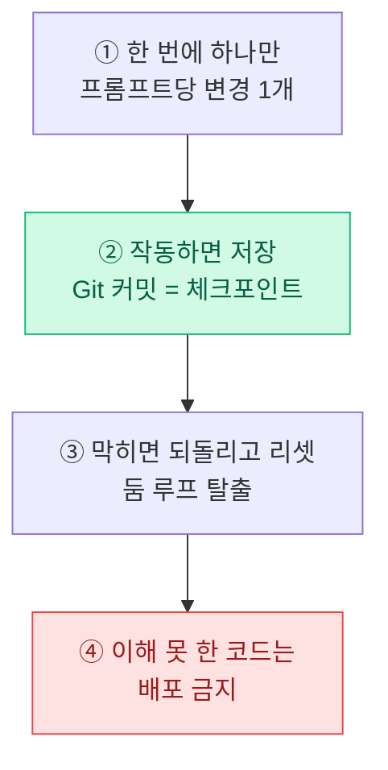

> 🏷️ **[NextX_R&D_Log]** · 모두의연구소 아이펠(AIFFEL) AI 에이전트 1기 학습 정리
{: .prompt-tip }

> 목표는 **'완성된 제품'이 아니라 '굴러가는 첫 조각(MVP)'** 입니다.
> AI 에이전트를 옆에 두고, 욕심을 버리고, 사용자가 **핵심 기능 하나를 끝까지** 해낼 수 있는 서비스를 배포하는 방법을 정리했습니다.
{: .prompt-info }

## 1. 프로젝트의 시작 — 마인드셋과 MVP

### 핵심 목표

거창한 완성이 아니라, 사용자가 **한 가지 핵심 기능을 처음부터 끝까지 수행**할 수 있는 **"굴러가는 첫 조각(MVP)"** 을 만드는 것.

> "첫 버전이 부끄럽지 않다면, 너무 늦게 출시한 것이다."
{: .prompt-warning }

실패의 진짜 원인은 **기능 부족이 아니라 과도한 기능 개발** — 이른바 **스코프 크립(Scope Creep)** 입니다. 완벽주의를 버리는 것이 첫 관문입니다.

### 범위 좁히기 — MoSCoW 기법

- **Must (필수)**: 핵심 문제 해결에 반드시 필요한 **기능 3가지만** 구현.
- **Won't (지금 안 함)**: "이것도 있으면 좋을 텐데"라는 유혹을 막기 위해, **안 만들 기능 5가지 이상을 미리** 적어둡니다.

> 팁: Won't 목록을 먼저 쓰는 것이 핵심입니다. 만들 것보다 **안 만들 것을 정하는 게** 범위를 지키는 힘입니다.
{: .prompt-tip }

---

## 2. 웹 만들기 5단계 실습 흐름

| 단계 | 주요 내용 | 핵심 요구사항 · 팁 |
|:---:|---|---|
| **1. PRD (기획서)** | 무엇을, 왜 만들지 **한 장**으로 정의 | 기술 스택은 정하지 말고 **AI에게 위임** |
| **2. 작업대 (하네스)** | Claude Code 등 개발 환경 세우기 | 로컬 실행 규칙과 `CLAUDE.md` 정리 |
| **3. 화면 (UI)** | **목업 데이터**로 눈에 보이는 화면 구성 | `frontend-design` 스킬로 'AI 느낌' 다듬기 |
| **4. 저장 + 정원** | 데이터 저장 및 동시성 문제 해결 | DB 수준의 **트랜잭션 / 원자적 저장** |
| **5. 한 바퀴 + 배포** | 통합 테스트 후 외부 웹 서비스 배포 | 비밀값(`.env`)은 **절대 코드에 노출 금지** |

> 💡 **확장 단계 (Supabase)**: 회원가입·로그인을 붙일 때는 반드시 **행 수준 보안(RLS, Row Level Security)** 을 설정해야 합니다. RLS가 없으면 로그인한 누구나 **남의 데이터까지** 조회할 수 있습니다.
{: .prompt-warning }

넥스트엑스가 실제로 이 5단계를 프리랜서 관리 SaaS에 적용한 과정은 [파트너스 매칭 매니저 프로토타입 제작기]()에서 확인할 수 있습니다.

---

## 3. 막혔을 때 — 4가지 절대 규율

AI와 함께 개발할 때 가장 자주 무너지는 지점이 여기입니다. 이 4가지만 지켜도 대부분의 사고를 막습니다.

1. **한 번에 하나만** — 프롬프트 하나당 변경 사항은 **딱 1개**. 여러 개를 한꺼번에 시키면 어디서 틀렸는지 알 수 없습니다.
2. **작동하면 저장 (Git 커밋)** — 기능이 **눈으로 확인될 때마다 즉시 커밋**해 복구 지점(체크포인트)을 만듭니다.
3. **막히면 되돌리고 리셋** — AI와 대화가 길어져 꼬이는 **둠 루프(Doom Loop)** 에 빠지면, 이전 커밋으로 되돌리고 **맥락을 요약해 새로 시작**합니다.
4. **이해 못 한 코드는 배포 금지** — 생성된 AI 코드의 **약 45%가 보안 결함**을 가질 수 있습니다. 내가 이해하지 못한 코드는 배포하지 않고 **보안 검토**를 거칩니다.

> 요약: **작게 바꾸고 · 자주 저장하고 · 막히면 되돌리고 · 모르면 배포하지 않는다.** 이 리듬이 AI 협업 개발의 안전벨트입니다.
{: .prompt-tip }

---

## 💡 마치며 — 부끄러운 첫 버전을 세상에 내놓기

MVP는 "대충 만들기"가 아닙니다. **무엇을 안 만들지 결정하는 규율**이고, **작동을 눈으로 확인하며 나아가는 방법론**입니다.

- **완벽주의 대신 출시** — 첫 조각을 빨리 내놓고 사용자 반응으로 다음을 정합니다.
- **AI는 강력한 동료, 판단은 나의 몫** — 기술 스택 선택과 코드 작성은 위임하되, **범위·보안·배포 여부는 사람이** 결정합니다.

이 관점은 [바이브 코딩이란 무엇인가]()와 [AI는 어떻게 배우나]()와 함께 읽으면, "AI와 함께 만든다"는 그림이 하나로 이어집니다.

---

> 📎 본 글은 **주식회사 넥스트엑스(NEXT X) 기술연구소**의 학습 기록(R&D Log)입니다.
> **함께 읽기** — [🧪 바이브 코딩이란?]() · [🛠️ 나만의 AI 작업대 차리기]() · [📖 블로그 안내]()
{: .prompt-info }
