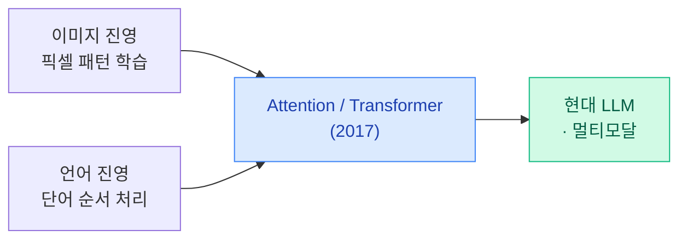
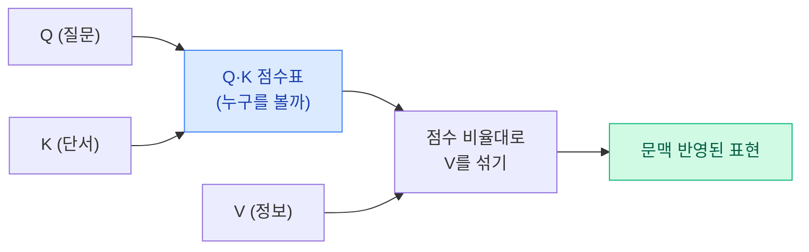
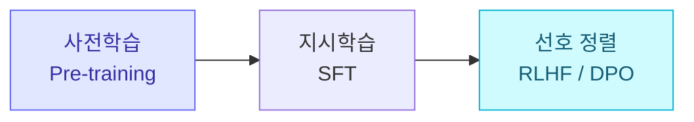
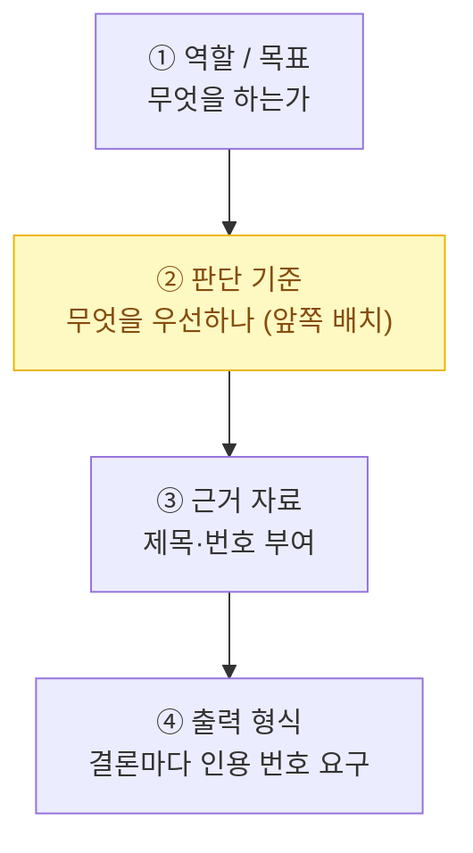

> 🏷️ **[NextX_R&D_Log]** · 모두의연구소 아이펠(AIFFEL) AI 에이전트 1기 학습 정리
{: .prompt-tip }

> 오늘의 거대 언어 모델(LLM)은 **이미지 처리**와 **언어 처리**가 각자의 벽에 부딪혔다가 **하나의 열쇠(어텐션)**로 풀리며 태어났습니다.
> 역사의 흐름부터 실무의 토큰·컨텍스트 설계까지, 큰 그림으로 정리했습니다.
{: .prompt-info }

## 1. AI 발전의 역사 — 이미지와 언어가 만난 길

### 이미지 진영이 부딪힌 '깊이의 벽'

- **CNN의 시작 (1998 LeNet ~ 2012 AlexNet)**: 사람이 특징을 직접 뽑던 방식에서 벗어나, 신경망이 **픽셀에서 직접 특징을 학습**하기 시작.
- **깊이의 저주(Vanishing Gradient)**: 성능을 높이려 층을 깊게 쌓을수록, 학습 신호가 앞쪽 층으로 오며 **0으로 사라지는** 문제 발생.
- **돌파구 — ResNet (2015)**: 신호가 층을 건너뛰는 **지름길(Skip Connection)**을 놓아 잔차(`F(x) + x`)만 학습하게 함으로써 **152층 이상**의 깊은 신경망 학습에 성공.

### 언어 진영이 부딪힌 '순서의 벽'

- **Word2Vec (2013)**: 단어를 **의미 벡터**로 표현해 단어 간 유사성 계산이 가능해짐.
- **RNN / LSTM의 한계**: 문장을 앞에서부터 **한 단어씩 순차적으로** 읽는 구조라, 긴 문장에서 앞 단어 기억이 사라지고 **GPU 병렬 계산이 불가능**.
- **Seq2Seq의 병목**: 문장 전체를 **고정된 하나의 벡터**에 압축하려다 긴 문장 정보가 뭉개짐.
- **어텐션의 등장 (2014~2015)**: 번역 시 원문의 모든 단어를 **그때그때 되돌아보며 가중치**를 주어 병목을 해결.

---

## 2. 혁신의 시작 — 트랜스포머(Transformer)

2017년 논문 **"Attention Is All You Need"** 는 순환 구조(RNN)를 **완전히 버리고 오직 어텐션만으로** 문장을 처리하는 구조를 제안했습니다.

- **병렬 처리의 문을 열다** — 모든 토큰이 서로를 **동시에** 바라보므로 GPU 병렬 계산이 가능해져, 대규모 데이터 학습의 길이 열림.

### Q · K · V 어텐션 원리

| 기호 | 이름 | 비유 |
|:---:|------|------|
| **Q** | Query | 내가 들고 온 **질문** |
| **K** | Key | 다른 토큰들이 내미는 **색인/단서** |
| **V** | Value | 실제로 가져오는 **정보** |

모든 Q와 K를 맞대어 **점수표**를 만들고, 그 **점수 비율대로 V를 섞어** 문맥을 반영합니다.

- **Multi-Head Attention** — 문장을 **여러 관점(주어–동사 관계, 문체, 예외 등)**에서 동시에 보기 위해 어텐션을 여러 개 **병렬로** 돌립니다.

---

## 3. 트랜스포머의 확장과 정렬(Alignment)

거대한 모델을 **사람에게 쓸모 있고 안전하게** 만드는 과정은 여러 단계로 나뉩니다.

| 단계 | 학습 방식·신호 | 목적·역할 |
|------|---------------|-----------|
| **사전학습 (Pre-training)** | 웹 규모 텍스트로 **다음 토큰 예측** | 세계 지식·언어 통계 형성 |
| **스케일링 법칙 (Scaling Law)** | 모델 크기·데이터·계산량 증대 | 성능 향상이 **예측 가능**해짐 → **인컨텍스트 러닝(Few-Shot)** 창발 |
| **지시학습 (SFT)** | 사람이 쓴 **모범 답안** 미세조정 | 대화 매너·행동 양식 이식 |
| **선호 정렬 (RLHF / DPO)** | 사람 피드백 기반 강화학습·직접 선호 최적화 | 사람이 **선호하는 가치·안전성** 입힘 |

### 모든 분야의 정복

어텐션은 글자뿐 아니라 **"조각으로 자를 수 있는 모든 데이터"**에 적용됩니다.

- **시각 (ViT, DiT)** — 이미지를 패치(16×16)로 잘라 글자 토큰처럼 처리.
- **음성 (Whisper)** — 오디오 스펙트로그램 조각을 토큰화해 단일 모델로 인식·번역.
- **동작·생물학 (Decision Transformer, AlphaFold)** — 로봇 궤적·단백질 서열을 시퀀스로 변환해 해결.

---

## 4. 실무의 핵심 — 토큰(Token)과 컨텍스트(Context)

어텐션은 모든 토큰이 서로를 참고하므로 계산량이 **토큰 수의 제곱(n²)**에 가깝게 늘어납니다. 긴 입력은 곧 **비용 증가 · 속도 지연 · KV Cache 메모리 부담**으로 직결됩니다.

> AI의 비용과 속도는 **'글자 수'가 아니라 '토큰 수'**로 결정됩니다.
{: .prompt-warning }

### 1) 토큰화의 언어별 차이

한국어는 **조사·어미·바이트 단위 깨짐** 때문에, 같은 의미라도 영어보다 **토큰을 훨씬 많이** 소비합니다(글자당 토큰 비용 증가).

### 2) 컨텍스트 윈도우 설계 — '네 칸 설계법'

넓은 작업대(긴 컨텍스트)를 준다고 AI가 똑똑해지지 않습니다. 정보가 중간에 묻히면 놓치는 **"Lost in the Middle"** 현상이 있어, 컨텍스트를 **구조화**해야 합니다.

- **역할/목표** — 무엇을 하는가
- **판단 기준** — 무엇을 우선하는가 (**프롬프트 앞쪽**에 배치)
- **근거 자료** — 무엇을 보고 답하나 (제목·번호 부여)
- **출력 형식** — 어떻게 내놓나 (결론마다 **인용한 자료 번호** 요구)

---

## 5. 실전 가이드 — 토큰 예산과 설계 캔버스

### 비용 절감 시 주의할 점

> "비용을 줄이려 **요약본만 넣자**"는 제안은 **위험한 압축**이 될 수 있습니다. 요약 과정에서 **도메인 핵심 근거(법적·의학적·규정 리스크)**가 누락될 수 있기 때문입니다.
{: .prompt-warning }

- **비용 최적화 원칙**: 단순 "토큰 줄이기"가 아니라 **"위험하지 않은 토큰부터 줄이기"**.

### 체크리스트

- [ ] **판단 기준**이 프롬프트 상단/앞쪽에 배치되었는가?
- [ ] 결론마다 **원문 출처(자료 ID·문장 번호)**를 추적할 수 있는가?
- [ ] 근거가 **부족하거나 충돌**할 때의 예외 처리 지침이 포함되었는가?

---

## 💡 한 문장 요약

> **토큰은 비용을 만들고, 컨텍스트는 한계를 만듭니다.** 트랜스포머를 잘 쓰는 일은 무조건 긴 입력을 넣는 것이 아니라, **필요한 문맥을 '검토 가능한 구조'로 배치**하는 일입니다.
{: .prompt-tip }

이 관점은 [AI는 어떻게 배우나]()(학습의 기본 원리), [임베딩 & 벡터 DB]()(의미를 숫자로), [RAG 쉽게 이해하기]()(근거를 붙이는 법)와 함께 읽으면 하나로 이어집니다.

---

> 📎 본 글은 **주식회사 넥스트엑스(NEXT X) 기술연구소**의 학습 기록(R&D Log)입니다.
> **함께 읽기** — [🧠 AI는 어떻게 배우나]() · [🔢 임베딩 & 벡터 DB]() · [🛠️ 도구를 쓰는 에이전트]()
{: .prompt-info }
