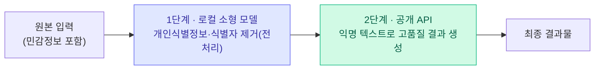

> 🏷️ **[NextX_R&D_Log]** · 모두의연구소 아이펠(AIFFEL) AI 에이전트 1기 학습 정리
{: .prompt-tip }

> "이 모델, 우리 노트북에서 돌아갈까?" 그리고 "로컬·API·프라이빗 중 무엇을 쓸까?"
> 이 두 질문을 **메모리·비용·데이터·통제권** 관점에서 판단할 수 있게 정리했습니다.
{: .prompt-info }

## 1. 내 노트북에서도 LLM이 돌아갈까? — 학습 vs 추론

같은 모델이라도 **학습(Training)**과 **추론(Inference)**은 필요한 메모리가 완전히 다릅니다.

| 구분 | 유지해야 하는 것 | 파라미터당 메모리 | 7B 모델 기준 |
|------|------------------|:---:|:---:|
| **학습** | 가중치 + 활성값 + 그래디언트 + 옵티마이저 상태 + FP32 마스터 사본 | **최소 18바이트+** | **126GB+ VRAM** |
| **추론** | 고정된 가중치로 행렬곱만 (FP16) | **2바이트** | **약 14GB VRAM** |

> 추론의 한계점: 토큰 생성 때 **모든 층의 가중치가 매번** 필요하므로, 디스크가 아니라 **메모리(VRAM)에 모델 전체가 올라가야** 실용적인 속도가 납니다.
{: .prompt-warning }

---

## 2. 거대한 모델을 노트북에 밀어넣기 — 양자화 & KV Cache

### 양자화(Quantization)

- **원리**: 16비트 실수(눈금 65,536개)를 **4비트(눈금 16개)** 등 성긴 눈금으로 반올림해, 저장 공간을 **1/4 수준**으로 줄임.
- **K-quant (예: Q4_K_M)**: 전체를 무조건 4비트로 깎지 않고, **블록별(256개/32개 단위) 스케일 값**을 적용. 품질에 치명적인 **어텐션 Value 행렬·피드포워드 아래쪽 사영 행렬** 일부에는 **6비트를 혼합**.
- **효율성 (Llama 3.1 8B)**: FP16 `14.96GB` → Q4_K_M `4.57GB` — 용량 **69.4% 감소**, 벤치마크 하락은 **0.5% 미만**이라 표준 선택지.

### VRAM 계산 공식과 KV Cache 함정

```text
필요 VRAM ≈ 파라미터 수(B) × 0.5GB (4비트 기준)
           + KV Cache
           + 런타임 오버헤드 (약 0.75GB)
```

- **KV Cache 청구서**: 대화·문서 입력이 길어질수록 Key/Value 벡터가 **선형으로 늘어나** 메모리를 크게 점유.
- **MoE (Mixture of Experts)**: 전체 파라미터는 크지만 토큰 생성 시 **일부 전문가만 활성화**되어, "용량은 크지만 생성은 빠른" 비대칭 이점. (예: gpt-oss-20b는 전체 21B 중 **토큰당 3.6B만** 활성화)

---

## 3. 내 컴퓨터에서 직접 돌려보기 — Ollama 실습

```text
ollama pull <모델>    # 다운로드
ollama run  <모델>    # 실행
ollama ps             # 메모리 적재 · GPU/CPU 분담률 확인
ollama stop <모델>    # 메모리 해제
```

- **체감 속도 지표**: `--verbose` 실행 시 나오는 **eval rate (tokens/s)** 가 핵심. **초당 15토큰 이상**이면 쾌적, **5토큰 이하**로 떨어지거나 **CPU 오프로딩**이 생기면 매우 답답해짐.
- **실험 포인트**:
  - **크기별** — 1GB 안팎 극소형 모델은 JSON 등 **복잡한 지시 형식을 어기는** 경향이 큼.
  - **정밀도(Q4 vs Q8)** — 짧은 프롬프트에선 차이가 거의 없으나, **복잡한 추론·고유명사** 기재에서 드러남.
  - **컨텍스트 확장** — 입력을 수만 토큰으로 늘려 **KV Cache가 VRAM을 초과하는 지점(CPU 오프로딩 발생점)**을 확인.

---

## 4. 로컬 vs API vs 관리형 프라이빗 배포

| 구분 | 공개 클라우드 API | 관리형 프라이빗 (Azure·AWS·GCP) | 로컬 / 온프레미스 |
|------|------------------|------------------------------|-----------------|
| **성능** | 최고 성능 프런티어 모델 즉시 | 카탈로그 내 최신·상위 모델 | 하드웨어에 올라가는 **공개 가중치** 한정 |
| **도입 시간** | API 키 발급 후 **몇 분** | 며칠~몇 주 (계약·리전 설계) | 인프라·하드웨어 조달 필요 |
| **비용 구조** | 사용 토큰당 **종량제** | 토큰 요금 + 관리 비용 | 초기 장비 투자 + 전기·운영 인력비 |
| **데이터 위치** | 사업자 공용 인프라 | 지정 **리전 내 전용 환경** | 내부 네트워크·장비 경계 안 |

> 성능 격차의 진실: 프런티어 **비공개** 모델과 최상위 **공개 가중치** 모델 사이엔 **약 4개월 이상**의 성능 차가 있습니다. 게다가 개인 노트북에서 도는 소형 모델은 최상위 공개 모델보다도 훨씬 작으므로, **실제 체감 격차는 더 큽니다.**
{: .prompt-warning }

---

## 5. 데이터 관점 — 어디에 무엇이 남는가

- **학습 불사용 ≠ 데이터 미저장**: API 제공사는 기본적으로 상용 API 데이터를 **학습에 쓰지 않지만**, 남용 모니터링·보안 로그 목적으로 **최대 30일** 보관.
- **ZDR(Zero Data Retention) 계약**을 맺어도 — 법적 요구, 안전 시스템 플래그(**최대 2~7년** 보관), 파일·배치 등 **상태 저장 기능** 사용 시엔 예외적으로 저장될 수 있음.
- **로컬의 보안 착시**: 데이터가 외부로 안 나가도, **노트북 분실·디스크 미암호화·사내 포트 미인증 개방·프롬프트 로그 백업** 등 내부 관리 소홀 시 사고 발생.

---

## 6. 비용 관점 — TCO(총소유비용)

- **API 비용**: 처리량·입력 문맥 길이·출력 토큰 길이에 **정비례**하여 투명하게 과금.
- **로컬 비용의 숨은 항목**: 하드웨어 구입·감가상각 · 전기·냉방 · **운영 인력 인건비**(모니터링·장애 대응·보안 패치) · 낮은 성능에 따른 **품질 검토/재작업** 인건비.

> 손익분기 착오 주의: "API가 비싸니 GPU 서버를 사자"고 무작정 결정하면, **낮은 가동률**과 **인건비 누락**으로 오히려 손실이 날 수 있습니다.
{: .prompt-warning }

---

## 7. 통제권(주권) 관점 — 누가 바꿀 수 있는가

- **API의 한계**: 제공사가 모델 버전을 **폐기·교체**하거나 출력을 미세 변경할 수 있음(일반 모델 예고 약 6개월, 프리뷰 2주 등). 장애 시 **복구 주체가 외부**.
- **로컬의 이점과 의무**:
  - 이점 — 모델 버전을 **완전히 고정**해 동일한 검증 환경 유지, **오프라인·폐쇄망** 동작 가능.
  - 의무 — 보안 패치·라이브러리 업데이트·성능 튜닝·장애 대응을 **조직 내부가 전부** 책임.

---

## 8. 최종 결정 프레임워크 — 하이브리드(라우팅)

로컬이냐 API냐 하는 **이분법보다, 업무 단계를 쪼개 배치**하는 하이브리드가 가장 효과적입니다.



**로컬 우선 검토** — 개인식별정보·영업비밀이 밀집된 데이터 / 폐쇄망·오프라인 / 단가를 0에 수렴시켜야 하는 대량·반복 작업.

**API 우선 검토** — 공개 데이터 기반의 복잡한 다단계 추론·요약 / 프런티어급 지시 준수율·코딩 품질이 필수인 업무.

---

## 💡 한 줄 정리

> **"돌아가느냐"는 추론 메모리(VRAM)가, "어디서 돌리느냐"는 데이터·비용·통제권이 결정합니다.** 정답은 하나를 고르는 게 아니라, **민감한 전처리는 로컬 · 고품질 생성은 API**로 단계를 나누는 하이브리드입니다.
{: .prompt-tip }

이 글은 [AI는 어떻게 배우나]()(학습 vs 추론의 기초)와 [트랜스포머]()(토큰·KV Cache의 원리), [ChatGPT vs Claude 업무 비교]()와 함께 읽으면 "어떤 모델을, 어디서, 얼마에 쓸지" 판단이 이어집니다.

---

> 📎 본 글은 **주식회사 넥스트엑스(NEXT X) 기술연구소**의 학습 기록(R&D Log)입니다.
> **함께 읽기** — [🧠 AI는 어떻게 배우나]() · [🔡 트랜스포머]() · [⚖️ ChatGPT vs Claude]()
{: .prompt-info }
