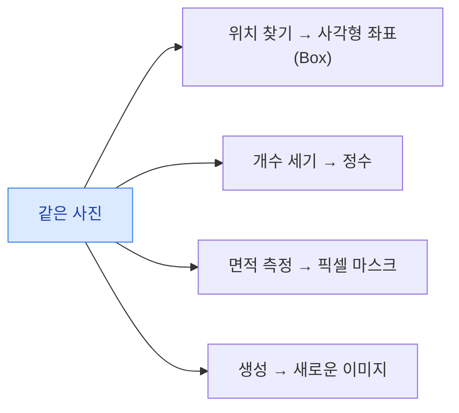
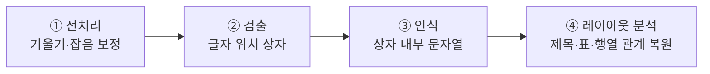

> 🏷️ **[NextX_R&D_Log]** · 모두의연구소 아이펠(AIFFEL) AI 에이전트 1기 학습 정리
{: .prompt-tip }

> AI에게 파일·사진 분석을 시킬 때, 사람이 실제로 원하는 **답의 형식(자료형)**은 업무마다 완전히 다릅니다.
> 입력이 같아도 **출력의 자료형이 다르면, 검증 방식과 책임 소재도 달라집니다.**
{: .prompt-info }

## 1. 개요 — 같은 입력(파일), 서로 다른 질문과 답

- **문서**: 단순히 **글자만 읽는 것**과, 글자 사이의 **관계·구조(어느 항목의 값인가)**를 파악하는 것은 완전히 다른 차원입니다.
- **사진**: 질문에 따라 출력물이 달라집니다.

> 핵심 결론: **입력이 같아도 출력의 자료형(Data Type)이 다르면, 검증 방식과 책임 소재도 완전히 달라집니다.**
{: .prompt-warning }

---

## 2. 문서 파이프라인 — 글자를 꺼내는 길 (OCR vs VLM)

### (1) PDF의 두 종류

1. **텍스트 레이어가 있는 PDF** — 단순 '읽기' 영역(코딩 몇 줄로 원문 추출 가능).
2. **스캔 이미지를 감싼 PDF** — 광학 패턴을 보고 글자를 알아보는 **OCR(광학 문자 인식)** 필수.

### (2) 전통적 OCR 조립 라인 (4단계)

독립적인 단계가 순차적으로 이어지는 파이프라인 구조입니다.

- **한글 문서의 어려움**: 조합 가능한 음절이 **11,172개**로 많고, '강/캉'·'밑/민'처럼 **획 하나** 차이로 뜻이 바뀌어 전처리 오류에 민감. 한자·영문·도장·밑줄·셀 병합·테두리 없는 표가 얽힘.
- **오류 전파(Error Propagation)**: 앞 단계의 작은 오류(예: 1도 기울어짐)가 뒤로 갈수록 **증폭**되어 최종 결과(금액 오류)를 망침. **뒤 단계는 앞 단계 오류를 스스로 복구하기 어려움.**

### (3) 전통 OCR vs 생성형 VLM

| | 전통 OCR (Tesseract, PaddleOCR) | 문서·범용 VLM (PaddleOCR-VL, Claude, ChatGPT) |
|---|---|---|
| **장점** | 글자와 **근거 좌표(상자)** 보존 → 오류 원인 **역추적·감사** 쉬움 | 시각 단서 + 언어 맥락 함께 해석 → 복잡한 표·수식(LaTeX)·읽기 순서를 **Markdown/JSON 구조**로 잘 복원 |
| **단점** | 셀 병합·테두리 없는 복잡한 표의 **구조 관계**를 놓치기 쉬움 | 디코딩 중 원문에 없는 내용을 그럴듯하게 지어내는 **환각(Hallucination)** → 근거 검증 필요 |

---

## 3. 사진 파이프라인 — 찾아내기와 경계 긋기

질문의 정밀도·목적에 따라 세 가지 핵심 기능으로 나뉩니다.

| 구분 | 출력 형식 | 주요 목적 | 실무 지표·고려사항 |
|------|----------|-----------|-------------------|
| **객체 탐지 (Detection)** | 사각형 좌표(Bounding Box) | "무엇이 어디에 몇 개?" · 빠른 위치 안내·후보 추출 | **IoU**(박스 겹침 정도) · **Conf Threshold**(오탐 vs 미탐의 정책 결정) |
| **이미지 분할 (Segmentation)** | 픽셀 단위 마스크(Mask) | "어디부터 어디까지?" · 불규칙 형태·면적 측정 | 라벨링·계산 비용 큼 · 도메인 전문가의 **경계 정의서** 필수 |
| **포즈 추정 (Pose)** | 관절 키포인트 + 선 | "어떤 자세인가?" · 작업자 안전·자세 분석 | 사람 신체 부위 위치 파악 |

### (1) 이미지 분할의 3가지 세부 유형

1. **시맨틱(Semantic)** — 개체 구별 없이 **종류(클래스)별**로만 픽셀을 칠함(예: 도로 면적 비율).
2. **인스턴스(Instance)** — 같은 종류라도 **개별 개체(사람1, 사람2)**를 구분해 마스크 생성.
3. **파놉틱(Panoptic)** — 배경(시맨틱) + 개체(인스턴스)를 **모두 포함**해 화면 전체 픽셀을 구분.

### (2) 실무 주의점

- **Bounding Box는 면적이 아니다** — 박스 크기로 결함 면적·재고량을 산출하면 큰 오차.
- **임계값(Conf Threshold)은 기술 설정이 아니라 업무 정책이다**:
  - 화재·안전장비 → **미탐(놓침)**을 줄이려 **낮은 선**에서 시작.
  - 자동 결제·문서 승인 → **오탐(헛짚음)**을 줄이려 **높은 선** 적용.
- **경계 정의서의 중요성** — 정교한 마스크도, 경계 기준(예: "폭 1mm 이상 균열만 포함")이 불명확하면 모델이 **오차·편향을 학습**. 도메인 전문가의 정의가 필수.

---

## 4. AI 도구 선택 및 상담 방법론

기술·모델은 계속 바뀌므로, 제품 이름을 외우기보다 **내 업무 제약에 맞춰 프롬프트로 의사결정을 유도하는 법**이 중요합니다.

1. **역질문 패턴(Flipped Interaction)** — 무작정 추천받지 말고, AI가 내 업무 조건·제약을 이해할 때까지 **한 번에 질문 하나씩** 던지게 만든다.
2. **추론과 사실 구분 + 반박 검토** — 아첨 편향(Sycophancy)을 막기 위해 "어떤 가정 위에서 추천했나", "어떤 조건에서 추천이 뒤집히나"를 검토.
3. **사람과 AI의 역할 분리**
   - **AI**: 후보 조사, 요약, 비교 프레임워크 작성.
   - **사람(담당자)**: 외부 데이터 반출 여부, 법적·보안 책임, 오탐/미탐 허용 한도 결정.

---

## 5. 실습 구조 한눈에 보기

### (1) 문서 읽기 실습 (PDF)

- **비교 대상**: Tesseract(로컬 OCR) / PaddleOCR(파이프라인 OCR) / PaddleOCR-VL(문서 VLM) / Claude·ChatGPT(범용 VLM)
- **핵심 지표**: `exact / partial / missing / invented / unclear`
- **원칙**: **가장 보기 편한 결과가 항상 옳은 것은 아니다.** 좌표 보존 필요성과 환각 검증을 **동시에** 관리.

### (2) 비전 실습 (YOLO)

- **도구**: Ultralytics YOLO26 (경량 가중치 `yolo26n.pt`, `yolo26n-seg.pt`, `yolo26n-pose.pt`)
- **핵심 체득**: 같은 사진을 넣어도 Head(탐지/분할/포즈)의 목적에 따라 **완전히 다른 자료형(박스·마스크·관절점)**이 출력됨을 확인.

---

## 💡 최종 핵심 요약 (체크리스트)

- **글자와 좌표 근거**가 꼭 필요할 때 → **전통 OCR** (Tesseract, PaddleOCR)
- **표·수식·두 단 구조·읽기 순서**가 중요할 때 → **문서 전용 / 범용 VLM**
- **자연어 질문·유연한 해석**이 필요할 때 → **범용 VLM** (Claude, ChatGPT)

> **사람이 반드시 원문을 재확인해야 하는 조건**
> 1. VLM 출력에서 **환각**(원문에 없는 숫자·내용)이 의심될 때
> 2. 좌표·근거가 불명확하고 신뢰도 점수가 **경계선(Threshold)**에 걸쳐 있을 때
> 3. **결제·법적 계약·안전 판정** 등 오류의 책임 오버헤드가 큰 업무일 때
{: .prompt-warning }

이 관점은 [트랜스포머]()(어텐션은 '자를 수 있는 모든 데이터'에 적용)와 [AI는 어떻게 배우나]()(데이터를 숫자로), [RAG 쉽게 이해하기]()(근거 검증)와 함께 읽으면 이어집니다.

---

> 📎 본 글은 **주식회사 넥스트엑스(NEXT X) 기술연구소**의 학습 기록(R&D Log)입니다.
> **함께 읽기** — [🔡 트랜스포머]() · [💻 내 노트북에서 LLM 돌리기]() · [🧠 AI는 어떻게 배우나]()
{: .prompt-info }
