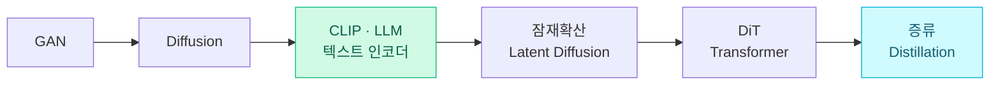
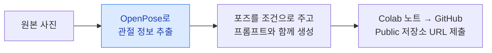

> 🏷️ **[NextX_R&D_Log]** · 모두의연구소 아이펠(AIFFEL) AI 에이전트 1기 학습 정리
{: .prompt-tip }

> [프로젝트] 이미지 생성 애플리케이션 만들기 — 핵심 원리부터 실무 프롬프트·코드·영상 생성·윤리적 판단까지 정리했습니다.
> 한 문장으로: **"안 적은 것은 모델이 대신 정합니다."**
{: .prompt-info }

## 1. 이미지 생성의 핵심 원리와 발전 과정

### 💡 프롬프트의 기본 원칙 — "안 적은 것은 모델이 대신 정한다"

- **모델을 바꾸기 전에 프롬프트부터**: 같은 모델·같은 시드(Seed)라도 **프롬프트 작성 방식**에 따라 완전히 다른 결과가 나옵니다.
- **빈 칸 없애기**: 명시하지 않은 속성(시선·조명·구도 등)은 모델이 **학습 데이터에서 가장 흔한 값**으로 임의 채움합니다.

### 🧬 이미지 생성 기술의 계보

| 구분 | GAN (적대적 생성 신경망) | Diffusion (확산 모델) |
|------|------------------------|---------------------|
| **원리** | 위조범(생성자) vs 감정사(판별자)가 대립하며 향상 | 원본에 노이즈를 섞었다가 **거꾸로 걷어내며** 생성 |
| **장점** | 한 번의 계산으로 **빠른 생성** | 학습 **안정성**이 높고 다채로운 생성 |
| **한계** | **모드 붕괴**(특정 패턴만 반복) | 초기엔 수백 단계 반복이라 **느림** |

- **CLIP & 언어모델 도입**: 이미지–텍스트를 **동일 공간의 좌표로 매핑**(CLIP). 이후 순수 LLM을 텍스트 인코더로 써서 **말귀를 훨씬 잘** 알아듣게 됨.
- **잠재 확산(Latent Diffusion)**: 픽셀 전체가 아니라 오토인코더로 압축한 **'잠재 공간'**에서 확산을 돌려, **개인 그래픽카드(VRAM)에서도** 동작.
- **DiT(Diffusion Transformer)**: U-Net을 **트랜스포머 어텐션** 구조로 교체 → 글자 표현력·스케일링 대폭 향상.
- **증류(Distillation)**: 선생 모델의 **50스텝을 1~4스텝**으로 축소(1초 남짓 생성).

---

## 2. 프롬프트 작성법 — 6가지 핵심 요소

> 단순 키워드 나열(`masterpiece, 8k, detailed`)보다 **완전한 문장**이 훨씬 잘 작동합니다.
{: .prompt-tip }

1. **피사체** — 누구/무엇이 몇 개.
2. **동작** — 무엇을 하고 어디서 끝나는가(시선 처리 포함).
3. **카메라** — 샷 크기·각도·렌즈 (지시어 **최대 3개**).
4. **조명** — 빛의 위치와 성질.
5. **환경** — 장소와 시간.
6. **스타일** — 사진·일러스트 등 전체 질감.
7. *(선택)* **재질·반응** — 표면 재질에 따른 빛의 반사/투과.

### ⚠️ 주의할 점

- **부정형 표현 지양** — "사람 없는 공장" ❌ → **"텅 빈 공장"(긍정형)** ✅.
- **네거티브 프롬프트** — 증류 모델(`guidance_scale=0.0`)에서는 **작동하지 않음**.
- **한계 인정** — 좁은 잠재 공간 탓에 손가락·화면 속 한글/글자는 무너지기 쉬움 → **구도 변경**이나 **인페인팅(Inpainting)/후편집** 활용.

---

## 3. 실무 — 코드로 자동화하기

### 🛠️ 3가지 실행 환경

| 환경 | 특징 |
|------|------|
| **브라우저** (Hugging Face Spaces 등) | 설치 없이 **빠른 감잡기** |
| **API 호출** (Pollinations 등) | URL/요청 세 줄로 **대량 작업 자동화** 연동 |
| **무료 GPU 직접 실행** (Google Colab / diffusers) | **보안 유지 · 파라미터 세부 제어** |

> 코드 팁: 증류 모델(FLUX.2-klein 4B, SDXL-Turbo 등)은 `guidance_scale=0.0`, `torch_dtype=torch.float16` 설정이 필수입니다.
{: .prompt-info }

---

## 4. 모델 선택 가이드 & 영상 생성

### 📜 오픈소스 라이선스 구분

- **Apache 2.0 / MIT** — 상업적 이용 자유 (예: FLUX.2-klein 4B, Z-Image-Turbo).
- **비상업 전용** — 상업 이용 불가 (예: FLUX.2-klein 9B).
- **커뮤니티 라이선스** — 매출 기준(예: 연 100만 달러)에 따라 상업 이용 제한 (예: SDXL-Turbo).

### 🎥 비디오 생성 프롬프트 규칙

- **카메라 고정 명시** — 안 적으면 멋대로 흔들림 → `Static locked-off camera` 필수 명시.
- **동작의 끝점 부여** — "걸어간다" ❌ → **"걸어와 문 앞에서 멈춘다"** ✅.
- **이미지 기반 영상화(Image-to-Video)** — 기존 이미지 묘사는 다시 적지 말고 **'추가될 움직임'만** 기술.

---

## 5. 실습 과제 & 책임감

### 📝 [과제] ControlNet으로 포즈 고정 도구 제작

### ⚖️ 판단과 책임

> AI 생성물은 '정답'을 채점하는 영역이 아니라 **선택과 책임의 영역**입니다. 실제와 혼동될 수 있는 이미지를 활용할 때는 **적절한 고지(AI 생성 표기)**와 윤리적 판단이 필요합니다.
{: .prompt-warning }

---

## 💡 한 줄 정리

> **모델보다 프롬프트가 먼저입니다.** 빈 칸을 없애 6요소를 완전한 문장으로 채우고, 증류로 빨라진 생성 속도를 실무에 붙이되, **실제와 혼동될 이미지에는 반드시 'AI 생성'을 고지**하세요.
{: .prompt-tip }

이 글은 [트랜스포머]()(DiT의 어텐션), [내 노트북에서 LLM 돌리기]()(잠재확산이 VRAM에서 도는 이유), [문서와 사진에서 무엇을 꺼낼까]()(OpenPose·비전)와 함께 읽으면 이어집니다.

---

> 📎 본 글은 **주식회사 넥스트엑스(NEXT X) 기술연구소**의 학습 기록(R&D Log)입니다.
> **함께 읽기** — [🔡 트랜스포머]() · [🖼️ 문서·사진에서 무엇을 꺼낼까]() · [💻 내 노트북에서 LLM 돌리기]()
{: .prompt-info }
