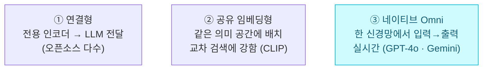
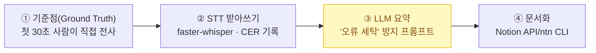

> 🏷️ **[NextX_R&D_Log]** · 모두의연구소 아이펠(AIFFEL) AI 에이전트 1기 학습 정리
{: .prompt-tip }

> 텍스트·이미지·음성·영상을 **하나의 작업 맥락**에서 함께 다루는 멀티모달 모델, 그리고 실무에서 가장 자주 쓰는 **음성(STT/TTS)** 처리를 정리했습니다.
> 마지막엔 **'오류 세탁'을 막는 회의록 자동화** 파이프라인까지 다룹니다.
{: .prompt-info }

## 1. 멀티모달 AI — 개념과 접근 방식

- **정의**: 텍스트·이미지·음성·영상·센서값 등 서로 다른 **모달리티(정보 전달 형식)**를 하나의 작업 맥락 안에서 **통합**해 다루는 모델.
- **핵심 원리 — 정렬(Alignment)**: 서로 다른 형식의 입력을 **공유 임베딩 공간(동일한 좌표계)**의 숫자 벡터로 전환 → 데이터 간 **거리를 재고 '의미의 유사성'**을 파악.

### 아키텍처 3가지 유형

1. **연결형** — 전용 인코더가 처리한 뒤 LLM에 전달(오픈소스 다수).
2. **공유 임베딩형** — 여러 모달리티를 **동일한 의미 공간**에 배치해 **교차 검색에 강함**(예: CLIP).
3. **네이티브 멀티모달(Omni LLM)** — 하나의 신경망에서 입력부터 출력까지 **실시간 흐름**으로 직접 처리(예: GPT-4o, Gemini).

---

## 2. 음성 처리 기술의 이해 (STT / Voice AI)

> 핵심 도전 과제: **이어지는 소리(파형)**와 **뚝뚝 끊어지는 글자** 사이의 **'시간 정렬(Time Alignment)'** 문제.
{: .prompt-warning }

**주요 발전 흐름**

- **스펙트로그램** — 음성 파형을 **시간–주파수 축의 무늬(이미지)**로 변환해 처리.
- **CTC (Connectionist Temporal Classification)** — 가능한 **모든 시간 정렬 확률을 더해** 정렬 문제를 손쉽게 극복.
- **Whisper (강건성 확보)** — **68만 시간**의 무작위 인터넷 음성으로 학습해, 실전 환경(잡음·회의실·전화)에서 높은 인식률 확보.

---

## 3. 한국어 실무 적용 — 주의점 & 최적화

- **모델 크기 < 언어 대응력**: 단순 영어용 대형 모델보다, **한국어를 추가 학습한 소형 모델**의 한글 전사 성능이 더 나을 수 있음.
- **평가 지표**: 한국어는 띄어쓰기 특성상 단어 단위(**WER**)가 아니라 **글자 단위(CER)**로 오차를 재야 정확함.
- **하드웨어·실행 환경 최적화**:
  - 같은 모델이라도 범용 판본보다 **기기 맞춤형 포맷(GGUF, MLX) + 양자화(8비트)**를 적용하면 속도가 비약적으로 향상.
  - 품질 개선은 **모델을 키우는 것보다** 마이크 교체(헤드셋)나 **사전 음성 정리(잡음 제거, 16kHz 단일 채널 변환)**가 더 효과적.

---

## 4. 음성 합성(TTS)과 Omni 모델의 실무 주의점

### TTS 선택 요건

- **라이선스 주의** — 무료 공개 모델이라도 **상업적 이용·사내 내부 업무 사용 제한** 조건이 있는지 확인.
- **기능 구분** — 단순 **목소리 선택**과, 10~30초 샘플로 음색·말투를 복제하는 **커스텀 Voice Cloning**은 명확히 다름.

### 통합 Omni vs 단계별 파이프라인

| | Omni 모델 (통합) | 단계별 파이프라인 (STT → LLM 요약) |
|---|---|---|
| **장점** | 중간 정보 손실(억양·침묵 등)이 적고 **맥락 파악이 빠름** | **오류 발생 위치 추적** 가능 → 근거 검증·감사 로그에 유리 |
| **적합 업무** | 실시간 대화·빠른 응답 | 회의록·계약 등 **책임·감사**가 중요한 업무 |

---

## 5. 실습 — 회의록 자동화 파이프라인

1. **기준점 산출** — 회의 첫 30초를 사람이 직접 받아 적은 **정답지(Ground Truth)** 작성.
2. **STT 받아쓰기 (faster-whisper)** — 모델 크기·음성 옵션을 **한 번에 하나씩** 바꾸며 **글자 오류율(CER)** 변화를 기록.
3. **LLM 요약 — '오류 세탁' 방지 프롬프트**:
   - 오기된 정보가 매끄럽게 포장되어 숨겨지는 **'오류 세탁'** 현상을 방지.
   - 의심스럽거나 왜곡된 문장은 **원문 그대로 인용**하게 하고, **타임스탬프(녹취 시각)**를 반드시 남기도록 지시.
4. **결과 문서화 (Notion API / ntn CLI)** — 결정 사항, 할 일(담당자·기한), **의심 구역**, 원본 녹음 시각을 마크다운으로 노션에 생성.

---

## 💡 한 줄 정리

> **멀티모달의 핵심은 '정렬' — 다른 형식을 같은 좌표로 놓는 일**입니다. 음성은 '시간 정렬' 문제를 스펙트로그램·CTC·Whisper로 풀어왔고, 실무에선 **한국어 CER로 평가하고, 책임이 큰 업무는 추적 가능한 파이프라인**으로 '오류 세탁'을 막으세요.
{: .prompt-tip }

이 글은 [트랜스포머]()(어텐션·정렬), [문서와 사진에서 무엇을 꺼낼까]()(Omni vs 파이프라인은 VLM vs OCR과 닮은꼴), [내 노트북에서 LLM 돌리기]()(GGUF·양자화)와 함께 읽으면 이어집니다.

---

> 📎 본 글은 **주식회사 넥스트엑스(NEXT X) 기술연구소**의 학습 기록(R&D Log)입니다.
> **함께 읽기** — [🔡 트랜스포머]() · [🖼️ 문서·사진에서 무엇을 꺼낼까]() · [🎨 AI는 어떻게 이미지를 그리나]()
{: .prompt-info }
